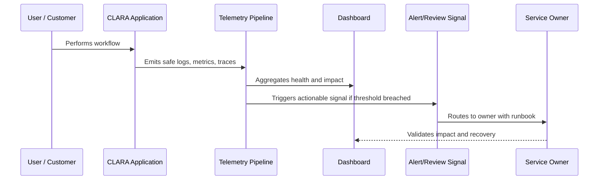

# Alerting Philosophy and Signal Quality

> *"Defines alerting principles, severity, ownership, routing, noise control, and actionability."*

---

# Purpose

Defines alerting principles, severity, ownership, routing, noise control, and actionability.

---

# Operational Problem

Bad alerts train teams to ignore production signals.

---

# Operational Decision

## Decision

CLARA alerts should be actionable, owned, user-impact-aware, low-noise, and linked to runbooks.

## Status

Accepted.

---

# Observability Rule

Every important CLARA capability must define:

```text
Capability -> Owner -> User Impact Signal -> Logs -> Metrics -> Trace/Correlation -> Dashboard -> Alert/Review Path -> Runbook
```

Observability should help teams answer:

```text
is it working
who is affected
where is it failing
why is it failing
how bad is it
what changed
how to recover
how to prevent recurrence
```

---

# Recommended Observability Flow



---

# Production-Ready Checklist

- [ ] User-impact signal is defined.
- [ ] Owner is assigned.
- [ ] Logs are structured and safe.
- [ ] Metrics are defined.
- [ ] Trace/correlation ID is propagated.
- [ ] Dashboard exists or is planned.
- [ ] Alert/review signal is actionable.
- [ ] Runbook is linked.
- [ ] Telemetry access is permission-controlled.
- [ ] Sensitive data is redacted/minimized.

---

# Acceptance Criteria

- [ ] Observability goal is clear.
- [ ] Telemetry sources are clear.
- [ ] User-impact mapping is clear.
- [ ] Dashboard and alert expectations are clear.
- [ ] Security/privacy boundaries are clear.
- [ ] Operational owner can act on the signal.
- [ ] AI coding assistants can follow this safely.

---

# Anti-patterns

Avoid:

- Logging full customer messages by default.
- Logging secrets, tokens, API keys, or credentials.
- Dashboards with no owner.
- Alerts without runbooks.
- Metrics that do not connect to user impact.
- No correlation ID across async jobs.
- Only monitoring infrastructure and not product workflows.
- Treating AI/integration observability as optional.
- Keeping noisy alerts that everyone ignores.
- Storing telemetry forever without retention decision.

---

# Related Documents

- ../PART-01-Operations-Foundation/README.md
- ../../BOOK-06-Security-Governance-and-Compliance/PART-07-Audit-Evidence-and-Compliance-Readiness/README.md
- ../../BOOK-06-Security-Governance-and-Compliance/PART-08-Incident-Response-and-Business-Continuity-Governance/README.md
- ../../BOOK-06-Security-Governance-and-Compliance/PART-05-AI-Governance-and-Model-Risk/README.md
- ../../BOOK-06-Security-Governance-and-Compliance/PART-06-Integration-and-Third-Party-Governance/README.md

---

# Navigation

**Previous:** `18-Dashboard-and-Operational-Views.md`

**Next:** `20-User-Impact-Observability.md`

---

# Alert Quality Rules

An alert should have:

```text
owner
severity
reason
threshold
runbook
dashboard link
expected action
silence/maintenance rule
review cadence
```

---

# Alert Severity

| Severity | Meaning |
|---|---|
| Critical | Immediate user/data/security impact or total failure |
| High | Major degradation requiring prompt response |
| Medium | Needs investigation during working/on-call window |
| Low | Review/trend signal, not urgent page |

---

# Noise Control

Reduce alert noise by:

```text
alerting on symptoms, not every cause
using burn-rate/error budget logic where mature
deduplicating related alerts
reviewing noisy alerts
removing unactionable alerts
```

---

# Alert Rule

If nobody knows what action to take, it should not page.
