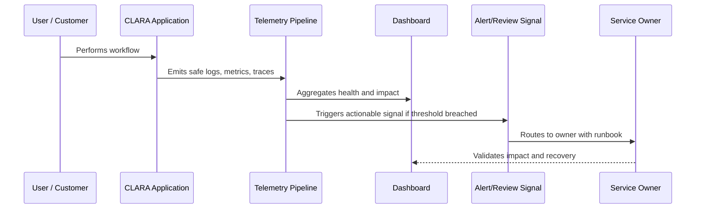

# AI Observability

> *"Defines observability for CLARA AI Gateway, model providers, prompt versions, context building, RAG, latency, cost, safety blocks, acceptance rate, and quality signals."*

---

# Purpose

Defines observability for CLARA AI Gateway, model providers, prompt versions, context building, RAG, latency, cost, safety blocks, acceptance rate, and quality signals.

---

# Operational Problem

AI failures can appear as quality regressions, latency spikes, cost spikes, safety blocks, context leaks, or provider outages.

---

# Operational Decision

## Decision

CLARA AI observability should make AI behavior measurable, explainable, bounded, and operationally controllable.

## Status

Accepted.

---

# Observability Rule

Every important CLARA capability must define:

```text
Capability -> Owner -> User Impact Signal -> Logs -> Metrics -> Trace/Correlation -> Dashboard -> Alert/Review Path -> Runbook
```

Observability should help teams answer:

```text
is it working
who is affected
where is it failing
why is it failing
how bad is it
what changed
how to recover
how to prevent recurrence
```

---

# Recommended Observability Flow



---

# Production-Ready Checklist

- [ ] User-impact signal is defined.
- [ ] Owner is assigned.
- [ ] Logs are structured and safe.
- [ ] Metrics are defined.
- [ ] Trace/correlation ID is propagated.
- [ ] Dashboard exists or is planned.
- [ ] Alert/review signal is actionable.
- [ ] Runbook is linked.
- [ ] Telemetry access is permission-controlled.
- [ ] Sensitive data is redacted/minimized.

---

# Acceptance Criteria

- [ ] Observability goal is clear.
- [ ] Telemetry sources are clear.
- [ ] User-impact mapping is clear.
- [ ] Dashboard and alert expectations are clear.
- [ ] Security/privacy boundaries are clear.
- [ ] Operational owner can act on the signal.
- [ ] AI coding assistants can follow this safely.

---

# Anti-patterns

Avoid:

- Logging full customer messages by default.
- Logging secrets, tokens, API keys, or credentials.
- Dashboards with no owner.
- Alerts without runbooks.
- Metrics that do not connect to user impact.
- No correlation ID across async jobs.
- Only monitoring infrastructure and not product workflows.
- Treating AI/integration observability as optional.
- Keeping noisy alerts that everyone ignores.
- Storing telemetry forever without retention decision.

---

# Related Documents

- ../PART-01-Operations-Foundation/README.md
- ../../BOOK-06-Security-Governance-and-Compliance/PART-07-Audit-Evidence-and-Compliance-Readiness/README.md
- ../../BOOK-06-Security-Governance-and-Compliance/PART-08-Incident-Response-and-Business-Continuity-Governance/README.md
- ../../BOOK-06-Security-Governance-and-Compliance/PART-05-AI-Governance-and-Model-Risk/README.md
- ../../BOOK-06-Security-Governance-and-Compliance/PART-06-Integration-and-Third-Party-Governance/README.md

---

# Navigation

**Previous:** `20-User-Impact-Observability.md`

**Next:** `22-Integration-and-Webhook-Observability.md`

---

# AI Observability Signals

Track:

```text
ai_request_count
ai_success_rate
ai_error_rate
ai_latency
provider_latency
provider_error_rate
prompt_template_version
model/provider used
context_size
RAG retrieval count
safety_block_count
human_accept/edit/reject rate
estimated cost
fallback/manual mode count
```

---

# AI Investigation Questions

```text
Which prompt version ran?
Which model/provider was used?
Which authorized context sources were used?
Was output reviewed?
Was output accepted, edited, or rejected?
Did safety block trigger?
Did provider latency/cost change?
```

---

# AI Privacy Rule

Prefer metadata and references over full raw prompts/outputs unless retention is justified and access-controlled.
