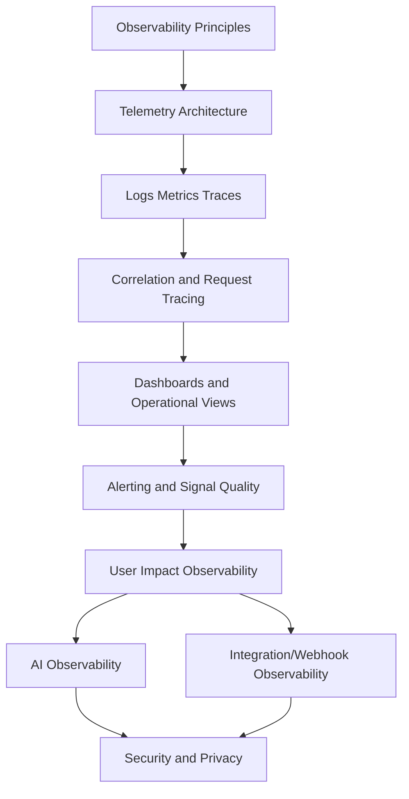

# PART-02 — Observability Strategy

> *"Observability is the difference between guessing and knowing what production is doing."*

---

# Purpose

Part 02 defines CLARA's observability strategy.

It covers:

- Observability Strategy overview.
- Observability Principles.
- Telemetry Architecture.
- Logs, Metrics, and Traces Strategy.
- Correlation IDs and Request Tracing.
- Dashboard and Operational Views.
- Alerting Philosophy and Signal Quality.
- User Impact Observability.
- AI Observability.
- Integration and Webhook Observability.
- Observability Security and Privacy.

---

# Chapter Map

| Chapter | Title |
|---:|---|
| 13 | Observability Strategy Overview |
| 14 | Observability Principles |
| 15 | Telemetry Architecture |
| 16 | Logs Metrics and Traces Strategy |
| 17 | Correlation IDs and Request Tracing |
| 18 | Dashboard and Operational Views |
| 19 | Alerting Philosophy and Signal Quality |
| 20 | User Impact Observability |
| 21 | AI Observability |
| 22 | Integration and Webhook Observability |
| 23 | Observability Security and Privacy |
| 24 | Part 02 Summary |

---

# Observability Strategy Map



---

# Observability Non-Negotiables

CLARA observability must enforce:

```text
user-impact visibility
service ownership
safe structured logs
useful metrics
trace/correlation IDs
actionable dashboards
alerts with runbooks
AI Gateway observability
integration health visibility
privacy-aware telemetry
secret redaction
least privilege dashboard/log access
```

---

# Relationship to Part 01

Part 01 defines:

```text
who owns operations and how production should be operated
```

Part 02 defines:

```text
how CLARA sees, explains, detects, and improves production behavior
```

---

# Navigation

**Previous:** `../PART-01-Operations-Foundation/12-Part-01-Summary.md`

**Next:** `13-Observability-Strategy-Overview.md`
