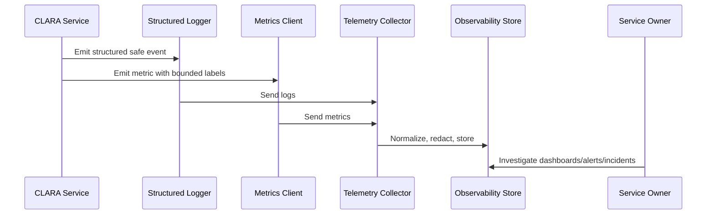

# Logging and Metrics Overview

> *"Introduces CLARA's logging and metrics standards for production debugging, reliability monitoring, incident response, AI operations, integration health, and audit support."*

---

# Purpose

Introduces CLARA's logging and metrics standards for production debugging, reliability monitoring, incident response, AI operations, integration health, and audit support.

---

# Operational Problem

Unstructured logs and inconsistent metrics create slow investigations, noisy dashboards, and weak incident evidence.

---

# Operational Decision

## Decision

CLARA should standardize logs and metrics so teams can debug production issues quickly, safely, and consistently.

## Status

Accepted.

---

# Logging and Metrics Rule

Every critical CLARA capability should define:

```text
events to log
metrics to emit
correlation fields
safe context fields
dashboard usage
alert usage
retention expectation
owner
```

Telemetry is production data and must be treated with security and privacy discipline.

---

# Recommended Telemetry Flow



---

# Production-Ready Checklist

- [ ] Structured logging format is used.
- [ ] Correlation/request IDs are included.
- [ ] Log level is appropriate.
- [ ] Sensitive data is redacted or excluded.
- [ ] Metric names follow convention.
- [ ] Metric labels are low-cardinality.
- [ ] User-impact metrics are defined where relevant.
- [ ] Dashboard/alert usage is clear.
- [ ] Owner is assigned.
- [ ] Retention/access expectation is clear.

---

# Acceptance Criteria

- [ ] Logging rules are clear.
- [ ] Metrics rules are clear.
- [ ] Naming and labels are consistent.
- [ ] Security/privacy requirements are clear.
- [ ] Operational owners can use the telemetry.
- [ ] AI coding assistants can follow this safely.

---

# Anti-patterns

Avoid:

- Raw unstructured production logs.
- Logging request/response bodies by default.
- Logging secrets, tokens, passwords, API keys, or OAuth credentials.
- Using user IDs, emails, or dynamic text as high-cardinality metric labels.
- Metrics with no unit.
- Alerts built from noisy/debug logs.
- Business metrics disconnected from technical metrics.
- AI telemetry that stores full prompts/outputs without justification.
- Integration telemetry that cannot trace event lifecycle.

---

# Related Documents

- ../PART-02-Observability-Strategy/README.md
- ../PART-01-Operations-Foundation/README.md
- ../../BOOK-06-Security-Governance-and-Compliance/PART-07-Audit-Evidence-and-Compliance-Readiness/76-Audit-Log-Governance.md
- ../../BOOK-06-Security-Governance-and-Compliance/PART-05-AI-Governance-and-Model-Risk/58-AI-Audit-Evidence-and-Traceability.md
- ../../BOOK-06-Security-Governance-and-Compliance/PART-06-Integration-and-Third-Party-Governance/70-Integration-Monitoring-Evidence-and-Health-Governance.md

---

# Navigation

**Previous:** `../PART-02-Observability-Strategy/24-Part-02-Summary.md`

**Next:** `26-Structured-Logging-Standards.md`

---

# Logging vs Metrics

```text
Logs: explain discrete events and failures.
Metrics: measure rates, latency, errors, volume, and saturation over time.
```

---

# Telemetry Scope

CLARA telemetry should cover:

```text
API requests
authentication/session
authorization decisions
database operations
queue and workers
AI Gateway
integration webhooks
outbound delivery
file operations
exports
critical business workflows
deployment/release events
```

---

# Core Questions

```text
What happened?
How often is it happening?
How slow is it?
Who/what is affected?
Which dependency is failing?
What changed recently?
Is this user-impacting?
```
