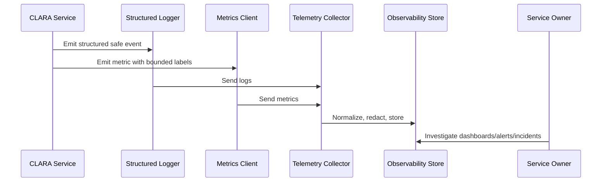

# Structured Logging Standards

> *"Defines CLARA's structured logging format, required fields, correlation fields, severity fields, context fields, and safe metadata rules."*

---

# Purpose

Defines CLARA's structured logging format, required fields, correlation fields, severity fields, context fields, and safe metadata rules.

---

# Operational Problem

Plain text logs are hard to query, correlate, redact, and use during incidents.

---

# Operational Decision

## Decision

CLARA logs should be structured, machine-queryable, correlation-aware, and safe from secrets or unnecessary sensitive data.

## Status

Accepted.

---

# Logging and Metrics Rule

Every critical CLARA capability should define:

```text
events to log
metrics to emit
correlation fields
safe context fields
dashboard usage
alert usage
retention expectation
owner
```

Telemetry is production data and must be treated with security and privacy discipline.

---

# Recommended Telemetry Flow



---

# Production-Ready Checklist

- [ ] Structured logging format is used.
- [ ] Correlation/request IDs are included.
- [ ] Log level is appropriate.
- [ ] Sensitive data is redacted or excluded.
- [ ] Metric names follow convention.
- [ ] Metric labels are low-cardinality.
- [ ] User-impact metrics are defined where relevant.
- [ ] Dashboard/alert usage is clear.
- [ ] Owner is assigned.
- [ ] Retention/access expectation is clear.

---

# Acceptance Criteria

- [ ] Logging rules are clear.
- [ ] Metrics rules are clear.
- [ ] Naming and labels are consistent.
- [ ] Security/privacy requirements are clear.
- [ ] Operational owners can use the telemetry.
- [ ] AI coding assistants can follow this safely.

---

# Anti-patterns

Avoid:

- Raw unstructured production logs.
- Logging request/response bodies by default.
- Logging secrets, tokens, passwords, API keys, or OAuth credentials.
- Using user IDs, emails, or dynamic text as high-cardinality metric labels.
- Metrics with no unit.
- Alerts built from noisy/debug logs.
- Business metrics disconnected from technical metrics.
- AI telemetry that stores full prompts/outputs without justification.
- Integration telemetry that cannot trace event lifecycle.

---

# Related Documents

- ../PART-02-Observability-Strategy/README.md
- ../PART-01-Operations-Foundation/README.md
- ../../BOOK-06-Security-Governance-and-Compliance/PART-07-Audit-Evidence-and-Compliance-Readiness/76-Audit-Log-Governance.md
- ../../BOOK-06-Security-Governance-and-Compliance/PART-05-AI-Governance-and-Model-Risk/58-AI-Audit-Evidence-and-Traceability.md
- ../../BOOK-06-Security-Governance-and-Compliance/PART-06-Integration-and-Third-Party-Governance/70-Integration-Monitoring-Evidence-and-Health-Governance.md

---

# Navigation

**Previous:** `25-Logging-and-Metrics-Overview.md`

**Next:** `27-Log-Levels-and-Usage.md`

---

# Required Structured Log Fields

Recommended baseline:

```json
{
  "timestamp": "2026-07-07T10:00:00.000Z",
  "level": "info",
  "service": "clara-api",
  "environment": "production",
  "event": "conversation.reply.sent",
  "message": "Conversation reply sent",
  "request_id": "req_...",
  "correlation_id": "corr_...",
  "actor_id": "usr_...",
  "organization_id": "org_...",
  "workspace_id": "wsp_...",
  "result": "success"
}
```

---

# Optional Context Fields

Use when relevant:

```text
trace_id
span_id
operation_id
job_id
event_id
conversation_id
ticket_id
integration_id
provider
ai_request_id
duration_ms
error_code
retry_count
```

---

# Safe Metadata Rule

Only log fields that are useful and safe.

Prefer IDs and references over raw content.
