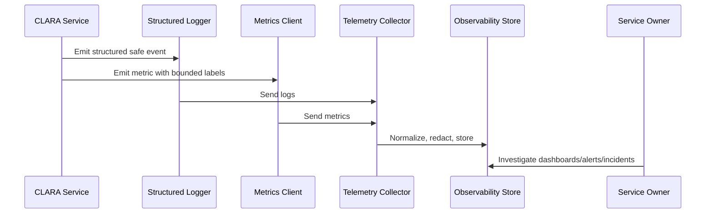

# Log Event Taxonomy

> *"Defines a consistent event taxonomy for application, security, audit-supporting, AI, integration, database, queue, and workflow logs."*

---

# Purpose

Defines a consistent event taxonomy for application, security, audit-supporting, AI, integration, database, queue, and workflow logs.

---

# Operational Problem

Without event taxonomy, searching and alerting across logs becomes inconsistent.

---

# Operational Decision

## Decision

CLARA should classify log events by domain, action, result, severity, and operational purpose.

## Status

Accepted.

---

# Logging and Metrics Rule

Every critical CLARA capability should define:

```text
events to log
metrics to emit
correlation fields
safe context fields
dashboard usage
alert usage
retention expectation
owner
```

Telemetry is production data and must be treated with security and privacy discipline.

---

# Recommended Telemetry Flow



---

# Production-Ready Checklist

- [ ] Structured logging format is used.
- [ ] Correlation/request IDs are included.
- [ ] Log level is appropriate.
- [ ] Sensitive data is redacted or excluded.
- [ ] Metric names follow convention.
- [ ] Metric labels are low-cardinality.
- [ ] User-impact metrics are defined where relevant.
- [ ] Dashboard/alert usage is clear.
- [ ] Owner is assigned.
- [ ] Retention/access expectation is clear.

---

# Acceptance Criteria

- [ ] Logging rules are clear.
- [ ] Metrics rules are clear.
- [ ] Naming and labels are consistent.
- [ ] Security/privacy requirements are clear.
- [ ] Operational owners can use the telemetry.
- [ ] AI coding assistants can follow this safely.

---

# Anti-patterns

Avoid:

- Raw unstructured production logs.
- Logging request/response bodies by default.
- Logging secrets, tokens, passwords, API keys, or OAuth credentials.
- Using user IDs, emails, or dynamic text as high-cardinality metric labels.
- Metrics with no unit.
- Alerts built from noisy/debug logs.
- Business metrics disconnected from technical metrics.
- AI telemetry that stores full prompts/outputs without justification.
- Integration telemetry that cannot trace event lifecycle.

---

# Related Documents

- ../PART-02-Observability-Strategy/README.md
- ../PART-01-Operations-Foundation/README.md
- ../../BOOK-06-Security-Governance-and-Compliance/PART-07-Audit-Evidence-and-Compliance-Readiness/76-Audit-Log-Governance.md
- ../../BOOK-06-Security-Governance-and-Compliance/PART-05-AI-Governance-and-Model-Risk/58-AI-Audit-Evidence-and-Traceability.md
- ../../BOOK-06-Security-Governance-and-Compliance/PART-06-Integration-and-Third-Party-Governance/70-Integration-Monitoring-Evidence-and-Health-Governance.md

---

# Navigation

**Previous:** `27-Log-Levels-and-Usage.md`

**Next:** `29-Metrics-Naming-and-Labeling-Standards.md`

---

# Event Naming Standard

Use dotted event names:

```text
domain.resource.action.result
```

Examples:

```text
auth.session.created
auth.login.failed
conversation.reply.sent
conversation.reply.failed
ticket.status.updated
ai.reply_draft.generated
ai.safety.blocked
integration.webhook.received
integration.webhook.validation_failed
queue.job.completed
queue.job.dead_lettered
```

---

# Event Categories

```text
auth
authorization
customer
conversation
ticket
knowledge
ai
integration
queue
database
file
export
security
release
```

---

# Event Result Values

Use consistent results:

```text
success
failure
blocked
denied
retrying
dead_lettered
degraded
skipped
```
