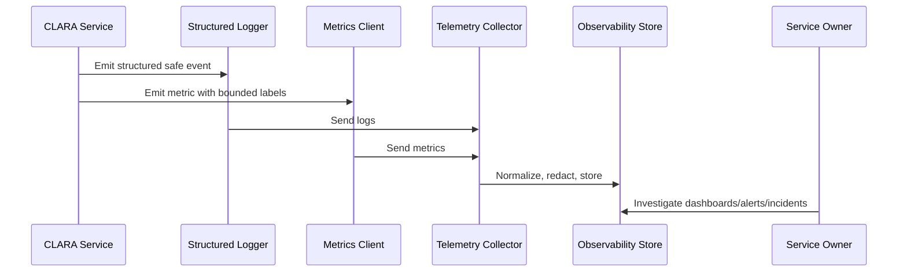

# API and Backend Metrics

> *"Defines required metrics for backend APIs, request lifecycle, authentication, authorization, latency, errors, throughput, and saturation."*

---

# Purpose

Defines required metrics for backend APIs, request lifecycle, authentication, authorization, latency, errors, throughput, and saturation.

---

# Operational Problem

Backend issues are hard to debug when teams only know that users are complaining.

---

# Operational Decision

## Decision

CLARA backend APIs should expose metrics that explain traffic, latency, errors, authorization outcomes, and user-impacting failures.

## Status

Accepted.

---

# Logging and Metrics Rule

Every critical CLARA capability should define:

```text
events to log
metrics to emit
correlation fields
safe context fields
dashboard usage
alert usage
retention expectation
owner
```

Telemetry is production data and must be treated with security and privacy discipline.

---

# Recommended Telemetry Flow



---

# Production-Ready Checklist

- [ ] Structured logging format is used.
- [ ] Correlation/request IDs are included.
- [ ] Log level is appropriate.
- [ ] Sensitive data is redacted or excluded.
- [ ] Metric names follow convention.
- [ ] Metric labels are low-cardinality.
- [ ] User-impact metrics are defined where relevant.
- [ ] Dashboard/alert usage is clear.
- [ ] Owner is assigned.
- [ ] Retention/access expectation is clear.

---

# Acceptance Criteria

- [ ] Logging rules are clear.
- [ ] Metrics rules are clear.
- [ ] Naming and labels are consistent.
- [ ] Security/privacy requirements are clear.
- [ ] Operational owners can use the telemetry.
- [ ] AI coding assistants can follow this safely.

---

# Anti-patterns

Avoid:

- Raw unstructured production logs.
- Logging request/response bodies by default.
- Logging secrets, tokens, passwords, API keys, or OAuth credentials.
- Using user IDs, emails, or dynamic text as high-cardinality metric labels.
- Metrics with no unit.
- Alerts built from noisy/debug logs.
- Business metrics disconnected from technical metrics.
- AI telemetry that stores full prompts/outputs without justification.
- Integration telemetry that cannot trace event lifecycle.

---

# Related Documents

- ../PART-02-Observability-Strategy/README.md
- ../PART-01-Operations-Foundation/README.md
- ../../BOOK-06-Security-Governance-and-Compliance/PART-07-Audit-Evidence-and-Compliance-Readiness/76-Audit-Log-Governance.md
- ../../BOOK-06-Security-Governance-and-Compliance/PART-05-AI-Governance-and-Model-Risk/58-AI-Audit-Evidence-and-Traceability.md
- ../../BOOK-06-Security-Governance-and-Compliance/PART-06-Integration-and-Third-Party-Governance/70-Integration-Monitoring-Evidence-and-Health-Governance.md

---

# Navigation

**Previous:** `29-Metrics-Naming-and-Labeling-Standards.md`

**Next:** `31-Database-and-Storage-Metrics.md`

---

# Required API Metrics

Track:

```text
http_requests_total
http_request_duration_ms
http_errors_total
http_requests_in_flight
auth_login_success_total
auth_login_failure_total
authorization_denied_total
api_validation_failure_total
rate_limit_block_total
```

---

# Recommended Labels

```text
service
environment
route_template
method
status_class
result
error_code
```

---

# API Dashboard Should Show

```text
request rate
p50/p95/p99 latency
error rate
top failing routes
authorization denied trend
rate limit trend
dependency latency
```

---

# Backend Security Note

Do not log raw headers or authorization tokens.
