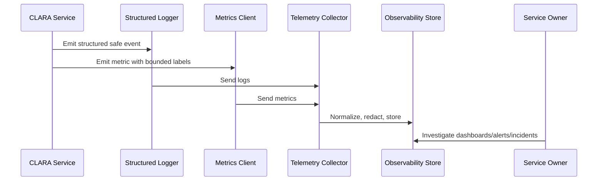

# Database and Storage Metrics

> *"Defines metrics for database performance, query latency, connection pools, migrations, storage usage, slow queries, and backup-related signals."*

---

# Purpose

Defines metrics for database performance, query latency, connection pools, migrations, storage usage, slow queries, and backup-related signals.

---

# Operational Problem

Many production failures start as database slowdowns, connection exhaustion, or storage pressure.

---

# Operational Decision

## Decision

CLARA database and storage metrics should reveal performance bottlenecks, capacity risk, data integrity risk, and operational degradation.

## Status

Accepted.

---

# Logging and Metrics Rule

Every critical CLARA capability should define:

```text
events to log
metrics to emit
correlation fields
safe context fields
dashboard usage
alert usage
retention expectation
owner
```

Telemetry is production data and must be treated with security and privacy discipline.

---

# Recommended Telemetry Flow



---

# Production-Ready Checklist

- [ ] Structured logging format is used.
- [ ] Correlation/request IDs are included.
- [ ] Log level is appropriate.
- [ ] Sensitive data is redacted or excluded.
- [ ] Metric names follow convention.
- [ ] Metric labels are low-cardinality.
- [ ] User-impact metrics are defined where relevant.
- [ ] Dashboard/alert usage is clear.
- [ ] Owner is assigned.
- [ ] Retention/access expectation is clear.

---

# Acceptance Criteria

- [ ] Logging rules are clear.
- [ ] Metrics rules are clear.
- [ ] Naming and labels are consistent.
- [ ] Security/privacy requirements are clear.
- [ ] Operational owners can use the telemetry.
- [ ] AI coding assistants can follow this safely.

---

# Anti-patterns

Avoid:

- Raw unstructured production logs.
- Logging request/response bodies by default.
- Logging secrets, tokens, passwords, API keys, or OAuth credentials.
- Using user IDs, emails, or dynamic text as high-cardinality metric labels.
- Metrics with no unit.
- Alerts built from noisy/debug logs.
- Business metrics disconnected from technical metrics.
- AI telemetry that stores full prompts/outputs without justification.
- Integration telemetry that cannot trace event lifecycle.

---

# Related Documents

- ../PART-02-Observability-Strategy/README.md
- ../PART-01-Operations-Foundation/README.md
- ../../BOOK-06-Security-Governance-and-Compliance/PART-07-Audit-Evidence-and-Compliance-Readiness/76-Audit-Log-Governance.md
- ../../BOOK-06-Security-Governance-and-Compliance/PART-05-AI-Governance-and-Model-Risk/58-AI-Audit-Evidence-and-Traceability.md
- ../../BOOK-06-Security-Governance-and-Compliance/PART-06-Integration-and-Third-Party-Governance/70-Integration-Monitoring-Evidence-and-Health-Governance.md

---

# Navigation

**Previous:** `30-API-and-Backend-Metrics.md`

**Next:** `32-Queue-and-Worker-Metrics.md`

---

# Required Database Metrics

Track:

```text
db_query_duration_ms
db_queries_total
db_query_errors_total
db_connections_active
db_connections_idle
db_connection_wait_ms
db_slow_queries_total
db_migration_duration_ms
db_migration_failure_total
storage_used_bytes
```

---

# Database Investigation Questions

```text
Are queries slower?
Is connection pool exhausted?
Did a migration run recently?
Which query family is slow?
Is storage capacity risky?
Are backups healthy?
```

---

# Storage Metrics

Track where relevant:

```text
file_upload_total
file_upload_failure_total
file_download_total
storage_object_count
storage_used_bytes
storage_error_total
```
