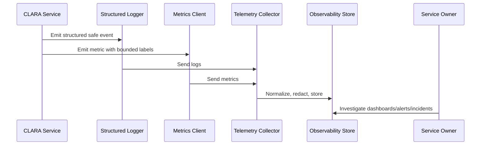

# AI Logging and Metrics

> *"Defines safe AI logging and metrics for AI Gateway, model providers, prompt versions, context building, RAG, latency, safety blocks, cost, review outcomes, and quality signals."*

---

# Purpose

Defines safe AI logging and metrics for AI Gateway, model providers, prompt versions, context building, RAG, latency, safety blocks, cost, review outcomes, and quality signals.

---

# Operational Problem

AI failures can be hidden as quality drift, provider latency, context problems, prompt regressions, or cost spikes.

---

# Operational Decision

## Decision

CLARA AI telemetry should preserve enough metadata to debug and govern AI behavior without over-logging sensitive prompts, outputs, or customer context.

## Status

Accepted.

---

# Logging and Metrics Rule

Every critical CLARA capability should define:

```text
events to log
metrics to emit
correlation fields
safe context fields
dashboard usage
alert usage
retention expectation
owner
```

Telemetry is production data and must be treated with security and privacy discipline.

---

# Recommended Telemetry Flow



---

# Production-Ready Checklist

- [ ] Structured logging format is used.
- [ ] Correlation/request IDs are included.
- [ ] Log level is appropriate.
- [ ] Sensitive data is redacted or excluded.
- [ ] Metric names follow convention.
- [ ] Metric labels are low-cardinality.
- [ ] User-impact metrics are defined where relevant.
- [ ] Dashboard/alert usage is clear.
- [ ] Owner is assigned.
- [ ] Retention/access expectation is clear.

---

# Acceptance Criteria

- [ ] Logging rules are clear.
- [ ] Metrics rules are clear.
- [ ] Naming and labels are consistent.
- [ ] Security/privacy requirements are clear.
- [ ] Operational owners can use the telemetry.
- [ ] AI coding assistants can follow this safely.

---

# Anti-patterns

Avoid:

- Raw unstructured production logs.
- Logging request/response bodies by default.
- Logging secrets, tokens, passwords, API keys, or OAuth credentials.
- Using user IDs, emails, or dynamic text as high-cardinality metric labels.
- Metrics with no unit.
- Alerts built from noisy/debug logs.
- Business metrics disconnected from technical metrics.
- AI telemetry that stores full prompts/outputs without justification.
- Integration telemetry that cannot trace event lifecycle.

---

# Related Documents

- ../PART-02-Observability-Strategy/README.md
- ../PART-01-Operations-Foundation/README.md
- ../../BOOK-06-Security-Governance-and-Compliance/PART-07-Audit-Evidence-and-Compliance-Readiness/76-Audit-Log-Governance.md
- ../../BOOK-06-Security-Governance-and-Compliance/PART-05-AI-Governance-and-Model-Risk/58-AI-Audit-Evidence-and-Traceability.md
- ../../BOOK-06-Security-Governance-and-Compliance/PART-06-Integration-and-Third-Party-Governance/70-Integration-Monitoring-Evidence-and-Health-Governance.md

---

# Navigation

**Previous:** `32-Queue-and-Worker-Metrics.md`

**Next:** `34-Integration-Logging-and-Metrics.md`

---

# AI Metrics

Track:

```text
ai_requests_total
ai_request_duration_ms
ai_provider_errors_total
ai_provider_latency_ms
ai_context_build_duration_ms
ai_context_items_count
ai_rag_retrieval_count
ai_safety_block_total
ai_output_review_accepted_total
ai_output_review_edited_total
ai_output_review_rejected_total
ai_estimated_cost
ai_fallback_total
```

---

# AI Log Metadata

Safe AI log fields:

```text
ai_request_id
feature
provider
model
prompt_template_id
prompt_version
organization_id
workspace_id
actor_id
result
duration_ms
safety_block_reason
context_source_count
```

---

# AI Telemetry Security Rule

Do not log full prompts, full outputs, raw internal notes, or raw customer messages by default.

Use references and metadata.
