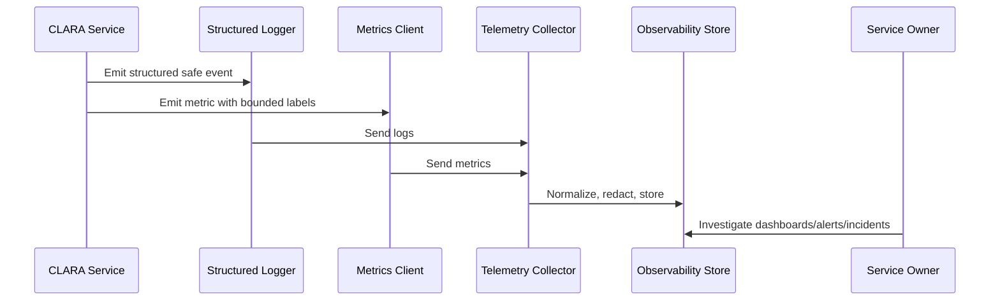

# Integration Logging and Metrics

> *"Defines logging and metrics for webhooks, provider APIs, connector health, retries, idempotency, delivery status, validation failures, and dead-letter handling."*

---

# Purpose

Defines logging and metrics for webhooks, provider APIs, connector health, retries, idempotency, delivery status, validation failures, and dead-letter handling.

---

# Operational Problem

Integration failures often occur at external boundaries where logs and metrics are weakest.

---

# Operational Decision

## Decision

CLARA integration telemetry should make external event processing traceable from provider receipt to final domain outcome.

## Status

Accepted.

---

# Logging and Metrics Rule

Every critical CLARA capability should define:

```text
events to log
metrics to emit
correlation fields
safe context fields
dashboard usage
alert usage
retention expectation
owner
```

Telemetry is production data and must be treated with security and privacy discipline.

---

# Recommended Telemetry Flow



---

# Production-Ready Checklist

- [ ] Structured logging format is used.
- [ ] Correlation/request IDs are included.
- [ ] Log level is appropriate.
- [ ] Sensitive data is redacted or excluded.
- [ ] Metric names follow convention.
- [ ] Metric labels are low-cardinality.
- [ ] User-impact metrics are defined where relevant.
- [ ] Dashboard/alert usage is clear.
- [ ] Owner is assigned.
- [ ] Retention/access expectation is clear.

---

# Acceptance Criteria

- [ ] Logging rules are clear.
- [ ] Metrics rules are clear.
- [ ] Naming and labels are consistent.
- [ ] Security/privacy requirements are clear.
- [ ] Operational owners can use the telemetry.
- [ ] AI coding assistants can follow this safely.

---

# Anti-patterns

Avoid:

- Raw unstructured production logs.
- Logging request/response bodies by default.
- Logging secrets, tokens, passwords, API keys, or OAuth credentials.
- Using user IDs, emails, or dynamic text as high-cardinality metric labels.
- Metrics with no unit.
- Alerts built from noisy/debug logs.
- Business metrics disconnected from technical metrics.
- AI telemetry that stores full prompts/outputs without justification.
- Integration telemetry that cannot trace event lifecycle.

---

# Related Documents

- ../PART-02-Observability-Strategy/README.md
- ../PART-01-Operations-Foundation/README.md
- ../../BOOK-06-Security-Governance-and-Compliance/PART-07-Audit-Evidence-and-Compliance-Readiness/76-Audit-Log-Governance.md
- ../../BOOK-06-Security-Governance-and-Compliance/PART-05-AI-Governance-and-Model-Risk/58-AI-Audit-Evidence-and-Traceability.md
- ../../BOOK-06-Security-Governance-and-Compliance/PART-06-Integration-and-Third-Party-Governance/70-Integration-Monitoring-Evidence-and-Health-Governance.md

---

# Navigation

**Previous:** `33-AI-Logging-and-Metrics.md`

**Next:** `35-Business-Workflow-Metrics.md`

---

# Integration Metrics

Track:

```text
integration_webhook_received_total
integration_webhook_validation_failed_total
integration_event_duplicate_total
integration_event_processed_total
integration_event_failed_total
integration_event_dead_lettered_total
integration_event_processing_duration_ms
integration_outbound_delivery_total
integration_outbound_delivery_failure_total
integration_provider_latency_ms
integration_provider_error_total
integration_credential_auth_failure_total
```

---

# Integration Log Fields

```text
provider
connector_id
organization_id
workspace_id
integration_event_id
idempotency_key_hash
result
retry_count
duration_ms
error_code
```

---

# Traceability Rule

For every provider event:

```text
received -> validated -> queued -> processed -> domain result -> outbound result if any
```
