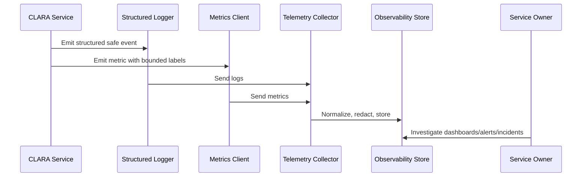

# Business Workflow Metrics

> *"Defines product and workflow metrics that connect technical health to user outcomes such as inbox load, reply send, ticket update, AI draft, search, and exports."*

---

# Purpose

Defines product and workflow metrics that connect technical health to user outcomes such as inbox load, reply send, ticket update, AI draft, search, and exports.

---

# Operational Problem

Infrastructure metrics can look healthy while core user workflows fail.

---

# Operational Decision

## Decision

CLARA should measure business workflow success, latency, error rate, and delay so teams can see real customer impact.

## Status

Accepted.

---

# Logging and Metrics Rule

Every critical CLARA capability should define:

```text
events to log
metrics to emit
correlation fields
safe context fields
dashboard usage
alert usage
retention expectation
owner
```

Telemetry is production data and must be treated with security and privacy discipline.

---

# Recommended Telemetry Flow



---

# Production-Ready Checklist

- [ ] Structured logging format is used.
- [ ] Correlation/request IDs are included.
- [ ] Log level is appropriate.
- [ ] Sensitive data is redacted or excluded.
- [ ] Metric names follow convention.
- [ ] Metric labels are low-cardinality.
- [ ] User-impact metrics are defined where relevant.
- [ ] Dashboard/alert usage is clear.
- [ ] Owner is assigned.
- [ ] Retention/access expectation is clear.

---

# Acceptance Criteria

- [ ] Logging rules are clear.
- [ ] Metrics rules are clear.
- [ ] Naming and labels are consistent.
- [ ] Security/privacy requirements are clear.
- [ ] Operational owners can use the telemetry.
- [ ] AI coding assistants can follow this safely.

---

# Anti-patterns

Avoid:

- Raw unstructured production logs.
- Logging request/response bodies by default.
- Logging secrets, tokens, passwords, API keys, or OAuth credentials.
- Using user IDs, emails, or dynamic text as high-cardinality metric labels.
- Metrics with no unit.
- Alerts built from noisy/debug logs.
- Business metrics disconnected from technical metrics.
- AI telemetry that stores full prompts/outputs without justification.
- Integration telemetry that cannot trace event lifecycle.

---

# Related Documents

- ../PART-02-Observability-Strategy/README.md
- ../PART-01-Operations-Foundation/README.md
- ../../BOOK-06-Security-Governance-and-Compliance/PART-07-Audit-Evidence-and-Compliance-Readiness/76-Audit-Log-Governance.md
- ../../BOOK-06-Security-Governance-and-Compliance/PART-05-AI-Governance-and-Model-Risk/58-AI-Audit-Evidence-and-Traceability.md
- ../../BOOK-06-Security-Governance-and-Compliance/PART-06-Integration-and-Third-Party-Governance/70-Integration-Monitoring-Evidence-and-Health-Governance.md

---

# Navigation

**Previous:** `34-Integration-Logging-and-Metrics.md`

**Next:** `36-Logging-Metrics-Security-Retention-and-Summary.md`

---

# Business Workflow Metrics

Track workflows users care about:

```text
workflow_login_success_total
workflow_inbox_load_duration_ms
workflow_conversation_open_duration_ms
workflow_reply_send_success_total
workflow_reply_send_failure_total
workflow_ticket_update_success_total
workflow_knowledge_search_duration_ms
workflow_ai_reply_draft_success_total
workflow_export_completed_total
workflow_attachment_upload_success_total
```

---

# Workflow Health Views

Dashboards should show:

```text
success rate
latency
error rate
volume
user-impacting failures
dependency failures
recent deployment correlation
```

---

# User-Impact Rule

If a metric does not help explain user impact or operational health, question why it exists.
