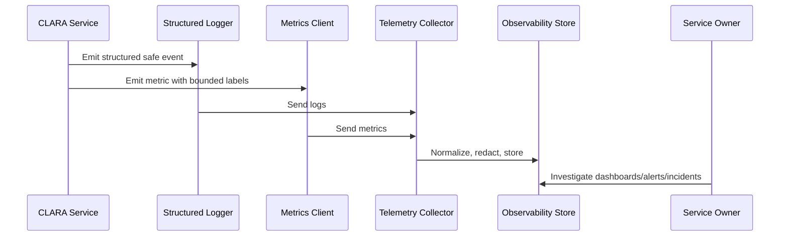

# Logging Metrics Security Retention and Summary

> *"Defines security, privacy, access control, retention, redaction, export, and review rules for logging and metrics, then summarizes Part 03."*

---

# Purpose

Defines security, privacy, access control, retention, redaction, export, and review rules for logging and metrics, then summarizes Part 03.

---

# Operational Problem

Telemetry can leak secrets, customer data, internal notes, and AI context if retention and redaction are not governed.

---

# Operational Decision

## Decision

CLARA logs and metrics must be useful for operations while being protected as sensitive production data.

## Status

Accepted.

---

# Logging and Metrics Rule

Every critical CLARA capability should define:

```text
events to log
metrics to emit
correlation fields
safe context fields
dashboard usage
alert usage
retention expectation
owner
```

Telemetry is production data and must be treated with security and privacy discipline.

---

# Recommended Telemetry Flow



---

# Production-Ready Checklist

- [ ] Structured logging format is used.
- [ ] Correlation/request IDs are included.
- [ ] Log level is appropriate.
- [ ] Sensitive data is redacted or excluded.
- [ ] Metric names follow convention.
- [ ] Metric labels are low-cardinality.
- [ ] User-impact metrics are defined where relevant.
- [ ] Dashboard/alert usage is clear.
- [ ] Owner is assigned.
- [ ] Retention/access expectation is clear.

---

# Acceptance Criteria

- [ ] Logging rules are clear.
- [ ] Metrics rules are clear.
- [ ] Naming and labels are consistent.
- [ ] Security/privacy requirements are clear.
- [ ] Operational owners can use the telemetry.
- [ ] AI coding assistants can follow this safely.

---

# Anti-patterns

Avoid:

- Raw unstructured production logs.
- Logging request/response bodies by default.
- Logging secrets, tokens, passwords, API keys, or OAuth credentials.
- Using user IDs, emails, or dynamic text as high-cardinality metric labels.
- Metrics with no unit.
- Alerts built from noisy/debug logs.
- Business metrics disconnected from technical metrics.
- AI telemetry that stores full prompts/outputs without justification.
- Integration telemetry that cannot trace event lifecycle.

---

# Related Documents

- ../PART-02-Observability-Strategy/README.md
- ../PART-01-Operations-Foundation/README.md
- ../../BOOK-06-Security-Governance-and-Compliance/PART-07-Audit-Evidence-and-Compliance-Readiness/76-Audit-Log-Governance.md
- ../../BOOK-06-Security-Governance-and-Compliance/PART-05-AI-Governance-and-Model-Risk/58-AI-Audit-Evidence-and-Traceability.md
- ../../BOOK-06-Security-Governance-and-Compliance/PART-06-Integration-and-Third-Party-Governance/70-Integration-Monitoring-Evidence-and-Health-Governance.md

---

# Navigation

**Previous:** `35-Business-Workflow-Metrics.md`

**Next:** `../PART-04-Alerting-and-Incident-Operations/README.md`

---

# Security and Privacy Rules

Do not log:

```text
passwords
tokens
API keys
webhook secrets
OAuth refresh tokens
full customer messages
raw internal notes
full AI prompts/outputs by default
payment details
private attachments
```

---

# Retention Guidance

Retention should depend on:

```text
security investigation needs
privacy risk
cost
customer trust requirements
incident response needs
compliance readiness
```

---

# Access Control

Logs and metrics access should be:

```text
least privilege
environment-scoped
role-based where possible
audited for sensitive stores
```

---

# Part 03 Completion

Part 03 establishes:

- Logging and metrics overview.
- Structured logging standards.
- Log levels and usage.
- Log event taxonomy.
- Metrics naming and labeling standards.
- API and backend metrics.
- Database and storage metrics.
- Queue and worker metrics.
- AI logging and metrics.
- Integration logging and metrics.
- Business workflow metrics.
- Logging/metrics security and retention.

---

# Ready for Part 04

The next part should be:

```text
BOOK VII — PART 04: Alerting and Incident Operations
```

It should define:

- Alerting strategy.
- Alert severity.
- Alert routing.
- On-call workflows.
- Incident declaration.
- Incident timeline.
- Escalation.
- Alert noise reduction.
- Incident command operations.
- Post-incident operational follow-up.
