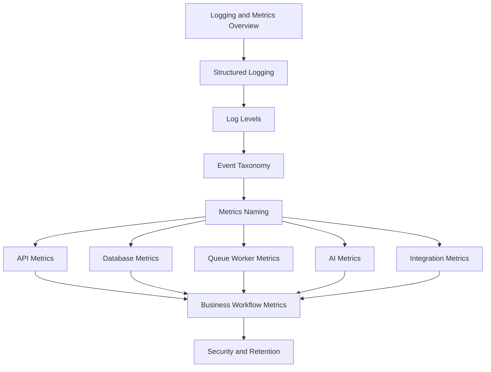

# PART-03 — Logging and Metrics

> *"Good logs explain what happened. Good metrics tell whether it matters."*

---

# Purpose

Part 03 defines CLARA's logging and metrics standards.

It covers:

- Logging and Metrics overview.
- Structured Logging Standards.
- Log Levels and Usage.
- Log Event Taxonomy.
- Metrics Naming and Labeling Standards.
- API and Backend Metrics.
- Database and Storage Metrics.
- Queue and Worker Metrics.
- AI Logging and Metrics.
- Integration Logging and Metrics.
- Business Workflow Metrics.
- Logging/Metrics security, retention, and summary.

---

# Chapter Map

| Chapter | Title |
|---:|---|
| 25 | Logging and Metrics Overview |
| 26 | Structured Logging Standards |
| 27 | Log Levels and Usage |
| 28 | Log Event Taxonomy |
| 29 | Metrics Naming and Labeling Standards |
| 30 | API and Backend Metrics |
| 31 | Database and Storage Metrics |
| 32 | Queue and Worker Metrics |
| 33 | AI Logging and Metrics |
| 34 | Integration Logging and Metrics |
| 35 | Business Workflow Metrics |
| 36 | Logging Metrics Security Retention and Summary |

---

# Logging and Metrics Map



---

# Logging and Metrics Non-Negotiables

CLARA logging and metrics must enforce:

```text
structured logs
correlation IDs
safe metadata only
consistent log levels
event taxonomy
metric naming conventions
low-cardinality labels
API latency/error metrics
database and queue metrics
AI Gateway metrics
integration health metrics
business workflow metrics
secret redaction
privacy-aware retention
```

---

# Relationship to Part 02

Part 02 defines observability strategy.

Part 03 defines the concrete logging and metrics standards that implement that strategy.

---

# Navigation

**Previous:** `../PART-02-Observability-Strategy/24-Part-02-Summary.md`

**Next:** `25-Logging-and-Metrics-Overview.md`
