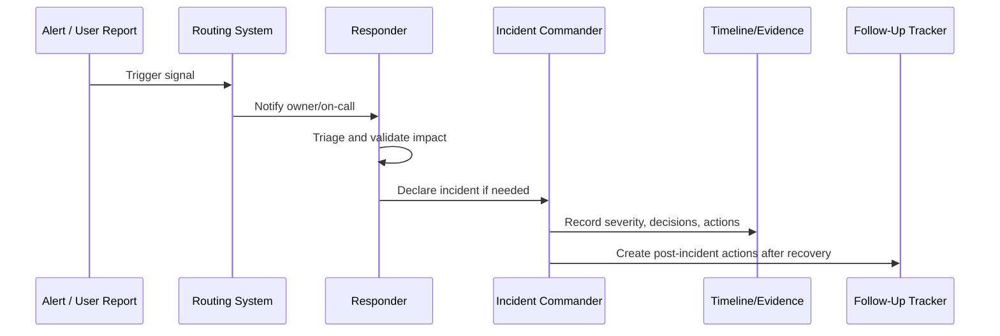

# Alerting and Incident Operations Overview

> *"Introduces CLARA's alerting and incident operations model for detecting production issues, routing signals, declaring incidents, coordinating response, and improving after recovery."*

---

# Purpose

Introduces CLARA's alerting and incident operations model for detecting production issues, routing signals, declaring incidents, coordinating response, and improving after recovery.

---

# Operational Problem

Alerts without ownership create noise, and incidents without operating structure create confusion during pressure.

---

# Operational Decision

## Decision

CLARA should treat alerts as operational commitments and incidents as coordinated response workflows with owners, evidence, communication, and follow-up.

## Status

Accepted.

---

# Alerting and Incident Rule

Every production alert or incident path must define:

```text
Signal -> Owner -> Severity -> Route -> Runbook -> Evidence -> Follow-Up
```

An alert is production-ready only when:

```text
someone owns it
someone can act on it
the action is documented
the severity is clear
the signal is trustworthy
the follow-up loop exists
```

---

# Recommended Response Flow



---

# Production-Ready Checklist

- [ ] Signal has owner.
- [ ] Severity is defined.
- [ ] Routing path is defined.
- [ ] Escalation path is defined.
- [ ] Runbook is linked.
- [ ] Dashboard/log query is linked where useful.
- [ ] Incident declaration criteria are clear.
- [ ] Evidence capture is defined.
- [ ] Security/privacy risk is considered.
- [ ] Follow-up process exists.

---

# Acceptance Criteria

- [ ] Alerting purpose is clear.
- [ ] Incident process is clear.
- [ ] Ownership and routing are clear.
- [ ] Runbook and evidence expectations are clear.
- [ ] Escalation path is clear.
- [ ] Alert tuning loop exists.
- [ ] AI coding assistants can follow this safely.

---

# Anti-patterns

Avoid:

- Alerts without responders.
- Alerts without runbooks.
- Alerts that page for non-actionable symptoms.
- Multiple teams assuming someone else owns the incident.
- Incident debugging with no timeline.
- Customer communication before facts are confirmed.
- Security/data incidents treated as normal bugs.
- Closing incidents without follow-up.
- Keeping noisy alerts because “maybe useful someday.”
- Making every warning a page.

---

# Related Documents

- ../PART-02-Observability-Strategy/README.md
- ../PART-03-Logging-and-Metrics/README.md
- ../PART-01-Operations-Foundation/08-Runbook-and-Playbook-Standards.md
- ../../BOOK-06-Security-Governance-and-Compliance/PART-08-Incident-Response-and-Business-Continuity-Governance/README.md
- ../../BOOK-06-Security-Governance-and-Compliance/PART-07-Audit-Evidence-and-Compliance-Readiness/README.md

---

# Navigation

**Previous:** `../PART-03-Logging-and-Metrics/36-Logging-Metrics-Security-Retention-and-Summary.md`

**Next:** `38-Alerting-Strategy.md`

---

# Scope

Alerting and incident operations covers:

```text
production alerts
dashboard review signals
support/customer reports
security alerts
AI behavior alerts
integration/provider alerts
database/queue alerts
deployment regression alerts
business workflow failure alerts
incident command
timeline/evidence capture
post-incident follow-up
```

---

# Core Questions

```text
Is this signal actionable?
Who owns it?
How urgent is it?
What user/customer impact exists?
Should this become an incident?
Who must be informed?
What evidence must be preserved?
What follow-up is required?
```
