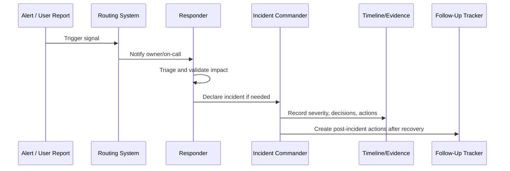

# Escalation and Stakeholder Notification

> *"Defines escalation rules and stakeholder notification expectations across engineering, product, support, security, leadership, and external providers."*

---

# Purpose

Defines escalation rules and stakeholder notification expectations across engineering, product, support, security, leadership, and external providers.

---

# Operational Problem

Incidents become worse when the right people learn about them too late.

---

# Operational Decision

## Decision

CLARA escalation should be based on severity, risk, customer impact, data/security impact, and duration.

## Status

Accepted.

---

# Alerting and Incident Rule

Every production alert or incident path must define:

```text
Signal -> Owner -> Severity -> Route -> Runbook -> Evidence -> Follow-Up
```

An alert is production-ready only when:

```text
someone owns it
someone can act on it
the action is documented
the severity is clear
the signal is trustworthy
the follow-up loop exists
```

---

# Recommended Response Flow



---

# Production-Ready Checklist

- [ ] Signal has owner.
- [ ] Severity is defined.
- [ ] Routing path is defined.
- [ ] Escalation path is defined.
- [ ] Runbook is linked.
- [ ] Dashboard/log query is linked where useful.
- [ ] Incident declaration criteria are clear.
- [ ] Evidence capture is defined.
- [ ] Security/privacy risk is considered.
- [ ] Follow-up process exists.

---

# Acceptance Criteria

- [ ] Alerting purpose is clear.
- [ ] Incident process is clear.
- [ ] Ownership and routing are clear.
- [ ] Runbook and evidence expectations are clear.
- [ ] Escalation path is clear.
- [ ] Alert tuning loop exists.
- [ ] AI coding assistants can follow this safely.

---

# Anti-patterns

Avoid:

- Alerts without responders.
- Alerts without runbooks.
- Alerts that page for non-actionable symptoms.
- Multiple teams assuming someone else owns the incident.
- Incident debugging with no timeline.
- Customer communication before facts are confirmed.
- Security/data incidents treated as normal bugs.
- Closing incidents without follow-up.
- Keeping noisy alerts because “maybe useful someday.”
- Making every warning a page.

---

# Related Documents

- ../PART-02-Observability-Strategy/README.md
- ../PART-03-Logging-and-Metrics/README.md
- ../PART-01-Operations-Foundation/08-Runbook-and-Playbook-Standards.md
- ../../BOOK-06-Security-Governance-and-Compliance/PART-08-Incident-Response-and-Business-Continuity-Governance/README.md
- ../../BOOK-06-Security-Governance-and-Compliance/PART-07-Audit-Evidence-and-Compliance-Readiness/README.md

---

# Navigation

**Previous:** `43-Incident-Command-Operations.md`

**Next:** `45-Incident-Timeline-and-Evidence-Capture.md`

---

# Escalation Triggers

Escalate when:

```text
severity is Critical/High
data/security impact possible
customer impact expanding
incident exceeds expected duration
rollback/mitigation fails
third-party provider involved
AI safety issue involved
legal/privacy review may be needed
support impact is high
```

---

# Stakeholder Groups

```text
engineering
operations/platform
security/privacy
product
support/customer success
leadership
external provider/vendor
customer-facing comms owner
```

---

# Notification Rule

Notify stakeholders with facts, impact, mitigation, next update time, and unknowns.

Avoid speculation.
