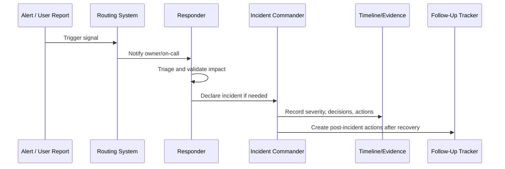

# Alert Noise Reduction and Tuning

> *"Defines how CLARA reviews noisy alerts, tunes thresholds, removes unactionable pages, and improves signal quality."*

---

# Purpose

Defines how CLARA reviews noisy alerts, tunes thresholds, removes unactionable pages, and improves signal quality.

---

# Operational Problem

Noisy alerts train teams to ignore the system.

---

# Operational Decision

## Decision

CLARA should continuously tune alerts so responders trust pages and dashboards.

## Status

Accepted.

---

# Alerting and Incident Rule

Every production alert or incident path must define:

```text
Signal -> Owner -> Severity -> Route -> Runbook -> Evidence -> Follow-Up
```

An alert is production-ready only when:

```text
someone owns it
someone can act on it
the action is documented
the severity is clear
the signal is trustworthy
the follow-up loop exists
```

---

# Recommended Response Flow



---

# Production-Ready Checklist

- [ ] Signal has owner.
- [ ] Severity is defined.
- [ ] Routing path is defined.
- [ ] Escalation path is defined.
- [ ] Runbook is linked.
- [ ] Dashboard/log query is linked where useful.
- [ ] Incident declaration criteria are clear.
- [ ] Evidence capture is defined.
- [ ] Security/privacy risk is considered.
- [ ] Follow-up process exists.

---

# Acceptance Criteria

- [ ] Alerting purpose is clear.
- [ ] Incident process is clear.
- [ ] Ownership and routing are clear.
- [ ] Runbook and evidence expectations are clear.
- [ ] Escalation path is clear.
- [ ] Alert tuning loop exists.
- [ ] AI coding assistants can follow this safely.

---

# Anti-patterns

Avoid:

- Alerts without responders.
- Alerts without runbooks.
- Alerts that page for non-actionable symptoms.
- Multiple teams assuming someone else owns the incident.
- Incident debugging with no timeline.
- Customer communication before facts are confirmed.
- Security/data incidents treated as normal bugs.
- Closing incidents without follow-up.
- Keeping noisy alerts because “maybe useful someday.”
- Making every warning a page.

---

# Related Documents

- ../PART-02-Observability-Strategy/README.md
- ../PART-03-Logging-and-Metrics/README.md
- ../PART-01-Operations-Foundation/08-Runbook-and-Playbook-Standards.md
- ../../BOOK-06-Security-Governance-and-Compliance/PART-08-Incident-Response-and-Business-Continuity-Governance/README.md
- ../../BOOK-06-Security-Governance-and-Compliance/PART-07-Audit-Evidence-and-Compliance-Readiness/README.md

---

# Navigation

**Previous:** `45-Incident-Timeline-and-Evidence-Capture.md`

**Next:** `47-Post-Incident-Operational-Follow-Up.md`

---

# Alert Review Questions

For each alert, ask:

```text
Did it detect real impact?
Was it actionable?
Was severity correct?
Was routing correct?
Was runbook useful?
Was threshold too sensitive?
Was it duplicated by another alert?
Should it become ticket-only or dashboard-only?
```

---

# Noise Reduction Actions

```text
tune threshold
add duration/window
deduplicate alerts
route differently
change to ticket
remove unactionable alert
improve metric/log source
improve runbook
```

---

# Noise Rule

A noisy alert is a reliability bug.
