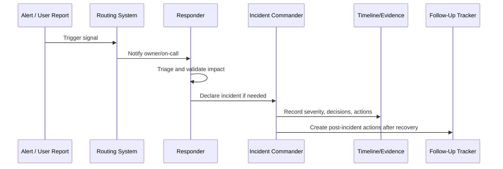

# Part 04 Summary

> *"Summarizes Alerting and Incident Operations and prepares for Book VII Part 05."*

---

# Purpose

Summarizes Alerting and Incident Operations and prepares for Book VII Part 05.

---

# Operational Problem

Reliability engineering depends on alerting and incident operations because reliability work must be driven by real operational signals.

---

# Operational Decision

## Decision

CLARA should proceed to Reliability Engineering after defining alert strategy, severity, routing, on-call workflow, declaration, command, escalation, evidence, alert tuning, and post-incident follow-up.

## Status

Accepted.

---

# Alerting and Incident Rule

Every production alert or incident path must define:

```text
Signal -> Owner -> Severity -> Route -> Runbook -> Evidence -> Follow-Up
```

An alert is production-ready only when:

```text
someone owns it
someone can act on it
the action is documented
the severity is clear
the signal is trustworthy
the follow-up loop exists
```

---

# Recommended Response Flow



---

# Production-Ready Checklist

- [ ] Signal has owner.
- [ ] Severity is defined.
- [ ] Routing path is defined.
- [ ] Escalation path is defined.
- [ ] Runbook is linked.
- [ ] Dashboard/log query is linked where useful.
- [ ] Incident declaration criteria are clear.
- [ ] Evidence capture is defined.
- [ ] Security/privacy risk is considered.
- [ ] Follow-up process exists.

---

# Acceptance Criteria

- [ ] Alerting purpose is clear.
- [ ] Incident process is clear.
- [ ] Ownership and routing are clear.
- [ ] Runbook and evidence expectations are clear.
- [ ] Escalation path is clear.
- [ ] Alert tuning loop exists.
- [ ] AI coding assistants can follow this safely.

---

# Anti-patterns

Avoid:

- Alerts without responders.
- Alerts without runbooks.
- Alerts that page for non-actionable symptoms.
- Multiple teams assuming someone else owns the incident.
- Incident debugging with no timeline.
- Customer communication before facts are confirmed.
- Security/data incidents treated as normal bugs.
- Closing incidents without follow-up.
- Keeping noisy alerts because “maybe useful someday.”
- Making every warning a page.

---

# Related Documents

- ../PART-02-Observability-Strategy/README.md
- ../PART-03-Logging-and-Metrics/README.md
- ../PART-01-Operations-Foundation/08-Runbook-and-Playbook-Standards.md
- ../../BOOK-06-Security-Governance-and-Compliance/PART-08-Incident-Response-and-Business-Continuity-Governance/README.md
- ../../BOOK-06-Security-Governance-and-Compliance/PART-07-Audit-Evidence-and-Compliance-Readiness/README.md

---

# Navigation

**Previous:** `47-Post-Incident-Operational-Follow-Up.md`

**Next:** `../PART-05-Reliability-Engineering/README.md`

---

# Part 04 Completion

Part 04 establishes:

- Alerting and incident operations overview.
- Alerting strategy.
- Alert severity and priority model.
- Alert routing and ownership.
- On-call workflow and responder readiness.
- Incident declaration and classification.
- Incident command operations.
- Escalation and stakeholder notification.
- Incident timeline and evidence capture.
- Alert noise reduction and tuning.
- Post-incident operational follow-up.

---

# Ready for Part 05

The next part should be:

```text
BOOK VII — PART 05: Reliability Engineering
```

It should define:

- Reliability principles.
- Critical user journeys.
- Failure mode analysis.
- Graceful degradation.
- Retry and timeout strategy.
- Idempotency and consistency.
- Dependency reliability.
- Queue reliability.
- AI reliability.
- Integration reliability.
- Reliability improvement roadmap.
