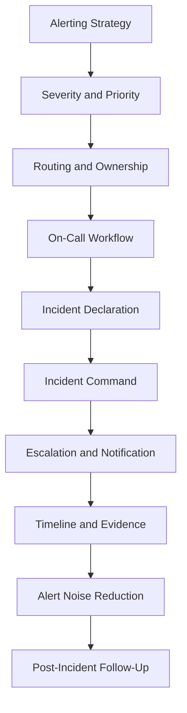

# PART-04 — Alerting and Incident Operations

> *"An alert is not a notification. An alert is a promise that someone can and should act."*

---

# Purpose

Part 04 defines CLARA's alerting and incident operations model.

It covers:

- Alerting and Incident Operations overview.
- Alerting Strategy.
- Alert Severity and Priority Model.
- Alert Routing and Ownership.
- On-Call Workflow and Responder Readiness.
- Incident Declaration and Classification.
- Incident Command Operations.
- Escalation and Stakeholder Notification.
- Incident Timeline and Evidence Capture.
- Alert Noise Reduction and Tuning.
- Post-Incident Operational Follow-Up.

---

# Chapter Map

| Chapter | Title |
|---:|---|
| 37 | Alerting and Incident Operations Overview |
| 38 | Alerting Strategy |
| 39 | Alert Severity and Priority Model |
| 40 | Alert Routing and Ownership |
| 41 | On Call Workflow and Responder Readiness |
| 42 | Incident Declaration and Classification |
| 43 | Incident Command Operations |
| 44 | Escalation and Stakeholder Notification |
| 45 | Incident Timeline and Evidence Capture |
| 46 | Alert Noise Reduction and Tuning |
| 47 | Post Incident Operational Follow Up |
| 48 | Part 04 Summary |

---

# Alerting and Incident Operations Map



---

# Non-Negotiables

CLARA alerting and incident operations must enforce:

```text
actionable alerts
alert ownership
alert severity model
runbook-linked alerts
clear routing
incident declaration criteria
incident commander for significant incidents
timeline and evidence capture
stakeholder escalation
alert noise review
post-incident action tracking
security/privacy-aware incident handling
```

---

# Relationship to Previous Parts

Part 02 defines observability strategy.

Part 03 defines logs and metrics.

Part 04 defines how those signals become alerting and incident response operations.

---

# Navigation

**Previous:** `../PART-03-Logging-and-Metrics/36-Logging-Metrics-Security-Retention-and-Summary.md`

**Next:** `37-Alerting-and-Incident-Operations-Overview.md`
