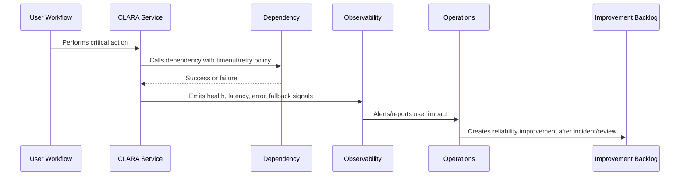

# Critical User Journeys

> *"Defines the critical CLARA user journeys that reliability engineering must protect and measure."*

---

# Purpose

Defines the critical CLARA user journeys that reliability engineering must protect and measure.

---

# Reliability Problem

Reliability work becomes unfocused when teams optimize infrastructure metrics without mapping them to user outcomes.

---

# Reliability Decision

## Decision

CLARA should identify and prioritize reliability around user journeys that directly affect customer support operations, message handling, AI assistance, ticket workflow, and customer trust.

## Status

Accepted.

---

# Reliability Rule

Every critical CLARA workflow must be designed as:

```text
Critical Journey -> Dependencies -> Failure Modes -> Detection -> Degradation/Fallback -> Recovery -> Evidence -> Improvement
```

A workflow is not reliable if the team cannot answer:

```text
what can fail
how users are affected
how failure is detected
how failure is contained
how the system degrades
how recovery happens
how duplicate actions are prevented
how the lesson improves the system
```

---

# Recommended Reliability Flow



---

# Production-Ready Checklist

- [ ] Critical user journey is identified.
- [ ] Dependencies are listed.
- [ ] Failure modes are documented.
- [ ] Detection signals exist.
- [ ] Timeout/retry behavior is defined.
- [ ] Idempotency is defined where retries/replays are possible.
- [ ] Graceful degradation/fallback exists where practical.
- [ ] Runbook exists for known failures.
- [ ] Recovery validation is defined.
- [ ] Post-incident improvement path exists.

---

# Acceptance Criteria

- [ ] Reliability goal is clear.
- [ ] User-impact mapping is clear.
- [ ] Failure modes are clear.
- [ ] Mitigation and fallback are clear.
- [ ] Observability and alerting are clear.
- [ ] Security/privacy is not weakened by fallback.
- [ ] AI coding assistants can follow this safely.

---

# Anti-patterns

Avoid:

- Infinite retries.
- No timeout on provider calls.
- Retrying non-idempotent mutations.
- Taking down core workflows because optional feature fails.
- One dependency failure cascading across all services.
- Ignoring queue backlog until users complain.
- Manual recovery steps with no runbook.
- AI/provider failure blocking human workflow.
- Webhook duplicates creating duplicate customer messages.
- Reliability fixes without tests or observability.

---

# Related Documents

- ../PART-02-Observability-Strategy/README.md
- ../PART-03-Logging-and-Metrics/README.md
- ../PART-04-Alerting-and-Incident-Operations/README.md
- ../../BOOK-06-Security-Governance-and-Compliance/PART-08-Incident-Response-and-Business-Continuity-Governance/README.md
- ../../BOOK-05-Engineering-Execution-Plan/PART-10-DevOps-and-Release-Execution/README.md

---

# Navigation

**Previous:** `50-Reliability-Principles.md`

**Next:** `52-Failure-Mode-Analysis.md`

---

# Initial Critical User Journeys

Recommended CLARA critical journeys:

```text
user login
load inbox
open conversation
send customer reply
create/update ticket
search customer
search knowledge
generate AI reply draft
receive integration message/webhook
process outbound provider delivery
upload/download attachment
export customer data
```

---

# Journey Record Template

```markdown
## Critical User Journey

Name:
User:
Business importance:
Dependencies:
Expected success signal:
Expected latency:
Failure modes:
Fallback:
Dashboard:
Alert:
Runbook:
Owner:
```

---

# Prioritization Rule

Reliability work should start with the journeys that affect customer support operations most directly.
