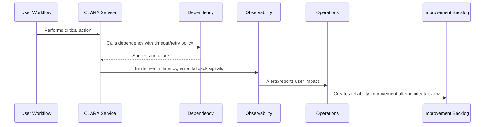

# Graceful Degradation and Fallbacks

> *"Defines how CLARA should continue partial service when dependencies, AI providers, integrations, queues, or non-critical features fail."*

---

# Purpose

Defines how CLARA should continue partial service when dependencies, AI providers, integrations, queues, or non-critical features fail.

---

# Reliability Problem

A system that fails completely when a non-critical dependency fails is too tightly coupled.

---

# Reliability Decision

## Decision

CLARA should design workflows so non-critical failures degrade safely instead of taking down critical user journeys.

## Status

Accepted.

---

# Reliability Rule

Every critical CLARA workflow must be designed as:

```text
Critical Journey -> Dependencies -> Failure Modes -> Detection -> Degradation/Fallback -> Recovery -> Evidence -> Improvement
```

A workflow is not reliable if the team cannot answer:

```text
what can fail
how users are affected
how failure is detected
how failure is contained
how the system degrades
how recovery happens
how duplicate actions are prevented
how the lesson improves the system
```

---

# Recommended Reliability Flow



---

# Production-Ready Checklist

- [ ] Critical user journey is identified.
- [ ] Dependencies are listed.
- [ ] Failure modes are documented.
- [ ] Detection signals exist.
- [ ] Timeout/retry behavior is defined.
- [ ] Idempotency is defined where retries/replays are possible.
- [ ] Graceful degradation/fallback exists where practical.
- [ ] Runbook exists for known failures.
- [ ] Recovery validation is defined.
- [ ] Post-incident improvement path exists.

---

# Acceptance Criteria

- [ ] Reliability goal is clear.
- [ ] User-impact mapping is clear.
- [ ] Failure modes are clear.
- [ ] Mitigation and fallback are clear.
- [ ] Observability and alerting are clear.
- [ ] Security/privacy is not weakened by fallback.
- [ ] AI coding assistants can follow this safely.

---

# Anti-patterns

Avoid:

- Infinite retries.
- No timeout on provider calls.
- Retrying non-idempotent mutations.
- Taking down core workflows because optional feature fails.
- One dependency failure cascading across all services.
- Ignoring queue backlog until users complain.
- Manual recovery steps with no runbook.
- AI/provider failure blocking human workflow.
- Webhook duplicates creating duplicate customer messages.
- Reliability fixes without tests or observability.

---

# Related Documents

- ../PART-02-Observability-Strategy/README.md
- ../PART-03-Logging-and-Metrics/README.md
- ../PART-04-Alerting-and-Incident-Operations/README.md
- ../../BOOK-06-Security-Governance-and-Compliance/PART-08-Incident-Response-and-Business-Continuity-Governance/README.md
- ../../BOOK-05-Engineering-Execution-Plan/PART-10-DevOps-and-Release-Execution/README.md

---

# Navigation

**Previous:** `52-Failure-Mode-Analysis.md`

**Next:** `54-Timeouts-Retries-and-Circuit-Breakers.md`

---

# Graceful Degradation Examples

| Failure | Degradation |
|---|---|
| AI provider unavailable | Disable AI drafting, keep manual reply |
| Knowledge search slow | Show fallback search/empty state, preserve core inbox |
| Integration provider down | Queue/retry inbound/outbound events |
| Analytics unavailable | Hide dashboard widget, preserve core workflows |
| Attachment preview fails | Allow download if safe and authorized |
| Notification delivery delayed | Show in-app status and retry |

---

# Fallback Design Rules

Fallbacks must be:

```text
safe
clear to user/operator
observable
permission-aware
reversible
documented in runbook
```

---

# Degradation Rule

Optional features should not take down critical workflows.
