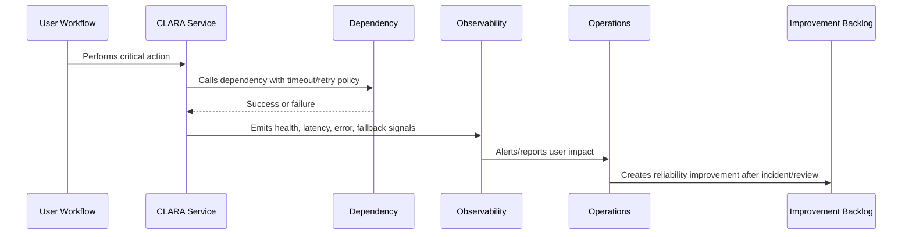

# Timeouts Retries and Circuit Breakers

> *"Defines reliability standards for timeouts, retries, backoff, jitter, circuit breakers, request deadlines, and failure containment."*

---

# Purpose

Defines reliability standards for timeouts, retries, backoff, jitter, circuit breakers, request deadlines, and failure containment.

---

# Reliability Problem

Unbounded waits and retries can turn one dependency issue into a full system outage.

---

# Reliability Decision

## Decision

CLARA should use explicit timeouts, bounded retries, exponential backoff, jitter, and circuit breakers for network and provider calls.

## Status

Accepted.

---

# Reliability Rule

Every critical CLARA workflow must be designed as:

```text
Critical Journey -> Dependencies -> Failure Modes -> Detection -> Degradation/Fallback -> Recovery -> Evidence -> Improvement
```

A workflow is not reliable if the team cannot answer:

```text
what can fail
how users are affected
how failure is detected
how failure is contained
how the system degrades
how recovery happens
how duplicate actions are prevented
how the lesson improves the system
```

---

# Recommended Reliability Flow



---

# Production-Ready Checklist

- [ ] Critical user journey is identified.
- [ ] Dependencies are listed.
- [ ] Failure modes are documented.
- [ ] Detection signals exist.
- [ ] Timeout/retry behavior is defined.
- [ ] Idempotency is defined where retries/replays are possible.
- [ ] Graceful degradation/fallback exists where practical.
- [ ] Runbook exists for known failures.
- [ ] Recovery validation is defined.
- [ ] Post-incident improvement path exists.

---

# Acceptance Criteria

- [ ] Reliability goal is clear.
- [ ] User-impact mapping is clear.
- [ ] Failure modes are clear.
- [ ] Mitigation and fallback are clear.
- [ ] Observability and alerting are clear.
- [ ] Security/privacy is not weakened by fallback.
- [ ] AI coding assistants can follow this safely.

---

# Anti-patterns

Avoid:

- Infinite retries.
- No timeout on provider calls.
- Retrying non-idempotent mutations.
- Taking down core workflows because optional feature fails.
- One dependency failure cascading across all services.
- Ignoring queue backlog until users complain.
- Manual recovery steps with no runbook.
- AI/provider failure blocking human workflow.
- Webhook duplicates creating duplicate customer messages.
- Reliability fixes without tests or observability.

---

# Related Documents

- ../PART-02-Observability-Strategy/README.md
- ../PART-03-Logging-and-Metrics/README.md
- ../PART-04-Alerting-and-Incident-Operations/README.md
- ../../BOOK-06-Security-Governance-and-Compliance/PART-08-Incident-Response-and-Business-Continuity-Governance/README.md
- ../../BOOK-05-Engineering-Execution-Plan/PART-10-DevOps-and-Release-Execution/README.md

---

# Navigation

**Previous:** `53-Graceful-Degradation-and-Fallbacks.md`

**Next:** `55-Idempotency-and-Consistency.md`

---

# Timeout Standards

Every external or potentially slow operation should define:

```text
connect timeout
request timeout
overall deadline
retry policy
fallback behavior
```

---

# Retry Rules

Use:

```text
bounded retries
exponential backoff
jitter
retry only retryable failures
idempotency keys for mutations
stop retrying when circuit is open
```

---

# Circuit Breaker Use Cases

Use circuit breakers for:

```text
AI provider
email/WhatsApp provider
webhook delivery provider
payment/billing provider
external APIs
slow internal dependency
```

---

# Retry Warning

Retries multiply load.

Bad retries can create an outage.
