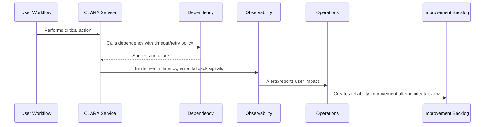

# Part 05 Summary

> *"Summarizes Reliability Engineering and prepares for Book VII Part 06."*

---

# Purpose

Summarizes Reliability Engineering and prepares for Book VII Part 06.

---

# Reliability Problem

Performance and capacity planning depend on reliability engineering because overloaded systems are unreliable systems.

---

# Reliability Decision

## Decision

CLARA should proceed to Performance and Capacity after defining reliability principles, critical journeys, failure analysis, degradation, retry strategy, idempotency, dependencies, async reliability, AI/integration reliability, and roadmap.

## Status

Accepted.

---

# Reliability Rule

Every critical CLARA workflow must be designed as:

```text
Critical Journey -> Dependencies -> Failure Modes -> Detection -> Degradation/Fallback -> Recovery -> Evidence -> Improvement
```

A workflow is not reliable if the team cannot answer:

```text
what can fail
how users are affected
how failure is detected
how failure is contained
how the system degrades
how recovery happens
how duplicate actions are prevented
how the lesson improves the system
```

---

# Recommended Reliability Flow



---

# Production-Ready Checklist

- [ ] Critical user journey is identified.
- [ ] Dependencies are listed.
- [ ] Failure modes are documented.
- [ ] Detection signals exist.
- [ ] Timeout/retry behavior is defined.
- [ ] Idempotency is defined where retries/replays are possible.
- [ ] Graceful degradation/fallback exists where practical.
- [ ] Runbook exists for known failures.
- [ ] Recovery validation is defined.
- [ ] Post-incident improvement path exists.

---

# Acceptance Criteria

- [ ] Reliability goal is clear.
- [ ] User-impact mapping is clear.
- [ ] Failure modes are clear.
- [ ] Mitigation and fallback are clear.
- [ ] Observability and alerting are clear.
- [ ] Security/privacy is not weakened by fallback.
- [ ] AI coding assistants can follow this safely.

---

# Anti-patterns

Avoid:

- Infinite retries.
- No timeout on provider calls.
- Retrying non-idempotent mutations.
- Taking down core workflows because optional feature fails.
- One dependency failure cascading across all services.
- Ignoring queue backlog until users complain.
- Manual recovery steps with no runbook.
- AI/provider failure blocking human workflow.
- Webhook duplicates creating duplicate customer messages.
- Reliability fixes without tests or observability.

---

# Related Documents

- ../PART-02-Observability-Strategy/README.md
- ../PART-03-Logging-and-Metrics/README.md
- ../PART-04-Alerting-and-Incident-Operations/README.md
- ../../BOOK-06-Security-Governance-and-Compliance/PART-08-Incident-Response-and-Business-Continuity-Governance/README.md
- ../../BOOK-05-Engineering-Execution-Plan/PART-10-DevOps-and-Release-Execution/README.md

---

# Navigation

**Previous:** `59-Reliability-Improvement-Roadmap.md`

**Next:** `../PART-06-Performance-and-Capacity/README.md`

---

# Part 05 Completion

Part 05 establishes:

- Reliability engineering overview.
- Reliability principles.
- Critical user journeys.
- Failure mode analysis.
- Graceful degradation and fallbacks.
- Timeouts, retries, and circuit breakers.
- Idempotency and consistency.
- Dependency reliability.
- Queue and async reliability.
- AI and integration reliability.
- Reliability improvement roadmap.

---

# Ready for Part 06

The next part should be:

```text
BOOK VII — PART 06: Performance and Capacity
```

It should define:

- Performance principles.
- Capacity planning.
- API performance.
- Database performance.
- Frontend performance.
- Queue/worker throughput.
- AI latency and cost performance.
- Integration throughput.
- Load testing.
- Performance budgets.
- Capacity review cadence.
