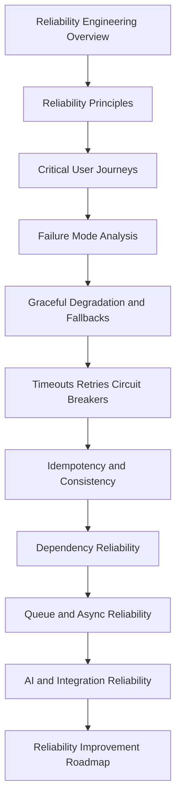

# PART-05 — Reliability Engineering

> *"Reliability is not the absence of failure. Reliability is the ability to keep user outcomes safe when failure happens."*

---

# Purpose

Part 05 defines CLARA's reliability engineering model.

It covers:

- Reliability Engineering overview.
- Reliability Principles.
- Critical User Journeys.
- Failure Mode Analysis.
- Graceful Degradation and Fallbacks.
- Timeouts, Retries, and Circuit Breakers.
- Idempotency and Consistency.
- Dependency Reliability.
- Queue and Async Reliability.
- AI and Integration Reliability.
- Reliability Improvement Roadmap.

---

# Chapter Map

| Chapter | Title |
|---:|---|
| 49 | Reliability Engineering Overview |
| 50 | Reliability Principles |
| 51 | Critical User Journeys |
| 52 | Failure Mode Analysis |
| 53 | Graceful Degradation and Fallbacks |
| 54 | Timeouts Retries and Circuit Breakers |
| 55 | Idempotency and Consistency |
| 56 | Dependency Reliability |
| 57 | Queue and Async Reliability |
| 58 | AI and Integration Reliability |
| 59 | Reliability Improvement Roadmap |
| 60 | Part 05 Summary |

---

# Reliability Engineering Map



---

# Reliability Non-Negotiables

CLARA reliability engineering must enforce:

```text
critical user journey mapping
failure mode analysis
bounded failures
explicit timeouts
bounded retries
backoff and jitter
circuit breakers for risky dependencies
idempotency for retried operations
dead-letter handling
manual fallback paths
AI/provider kill switches
integration retry safety
runbooks for known failure modes
post-incident reliability improvements
```

---

# Relationship to Previous Parts

Part 02 defines observability strategy.

Part 03 defines logs and metrics.

Part 04 defines alerting and incident operations.

Part 05 defines how CLARA designs systems to fail safely and recover quickly.

---

# Navigation

**Previous:** `../PART-04-Alerting-and-Incident-Operations/48-Part-04-Summary.md`

**Next:** `49-Reliability-Engineering-Overview.md`
