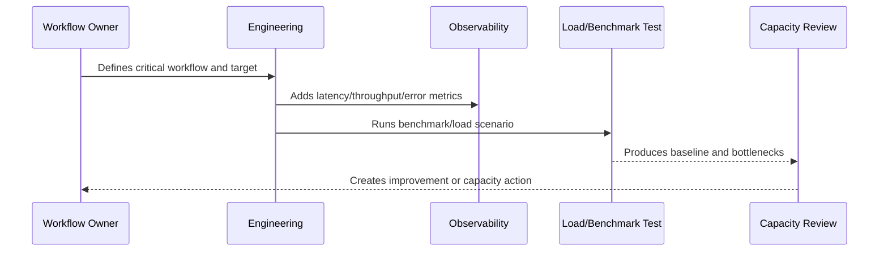

# Performance and Capacity Overview

> *"Introduces CLARA's performance and capacity model for keeping critical workflows fast, scalable, cost-aware, and reliable under production load."*

---

# Purpose

Introduces CLARA's performance and capacity model for keeping critical workflows fast, scalable, cost-aware, and reliable under production load.

---

# Performance Problem

Slow systems become unreliable systems because latency, saturation, and resource exhaustion eventually create user-facing failures.

---

# Performance Decision

## Decision

CLARA should treat performance and capacity as production reliability concerns tied to critical user journeys, system dependencies, cost, and operational risk.

## Status

Accepted.

---

# Performance and Capacity Rule

Every critical CLARA workflow should be managed as:

```text
Workflow -> Performance Target -> Capacity Limit -> Bottleneck -> Monitoring -> Test Evidence -> Review Cadence -> Improvement Plan
```

A production workflow is not performance-ready if the team cannot answer:

```text
how fast it should be
how much load it can handle
what happens when load grows
where the bottleneck is likely
how to detect regression
how to test scale safely
how to reduce cost without breaking UX
```

---

# Recommended Performance Flow



---

# Production-Ready Checklist

- [ ] Critical workflow is identified.
- [ ] Latency target is defined.
- [ ] Throughput expectation is defined.
- [ ] Payload/data size assumptions are defined.
- [ ] Bottleneck hypothesis is documented.
- [ ] Metrics exist.
- [ ] Load/benchmark scenario exists where relevant.
- [ ] Capacity threshold is defined.
- [ ] Regression review path exists.
- [ ] Cost impact is considered.

---

# Acceptance Criteria

- [ ] Performance target is clear.
- [ ] Capacity assumptions are clear.
- [ ] Bottlenecks are observable.
- [ ] Load test or benchmark evidence exists where needed.
- [ ] Review cadence is defined.
- [ ] Security/privacy is not weakened by optimization.
- [ ] AI coding assistants can follow this safely.

---

# Anti-patterns

Avoid:

- Optimizing without a user-impact target.
- Loading huge lists without pagination.
- Missing database indexes on critical queries.
- High-cardinality metrics for IDs/emails.
- Caching sensitive data without access controls.
- Infinite queue concurrency.
- AI prompts with unnecessary context.
- Retrying provider calls so hard that cost explodes.
- Load testing against production without approval.
- Ignoring performance regression until customer complaints.

---

# Related Documents

- ../PART-05-Reliability-Engineering/README.md
- ../PART-03-Logging-and-Metrics/README.md
- ../PART-02-Observability-Strategy/README.md
- ../../BOOK-05-Engineering-Execution-Plan/PART-10-DevOps-and-Release-Execution/README.md
- ../../BOOK-06-Security-Governance-and-Compliance/PART-09-Secure-SDLC-Governance/README.md

---

# Navigation

**Previous:** `../PART-05-Reliability-Engineering/60-Part-05-Summary.md`

**Next:** `62-Performance-Principles.md`

---

# Performance Scope

CLARA performance and capacity covers:

```text
frontend load and interaction
backend API latency
database query performance
queue and worker throughput
AI Gateway latency and cost
RAG/context building latency
integration webhook ingestion
outbound delivery throughput
file upload/download
export generation
dashboard/reporting queries
```

---

# Core Performance Questions

```text
Which workflows must feel fast?
What is the acceptable latency?
What throughput do we expect?
What is the growth assumption?
What is the bottleneck?
What metric proves regression?
What is the capacity limit?
```
