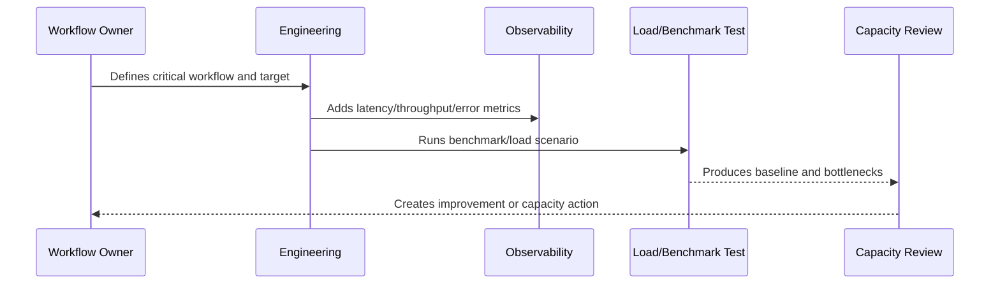

# Performance Principles

> *"Defines CLARA's performance principles across backend, frontend, database, queues, AI, integrations, and infrastructure."*

---

# Purpose

Defines CLARA's performance principles across backend, frontend, database, queues, AI, integrations, and infrastructure.

---

# Performance Problem

Performance work becomes wasteful when teams optimize without knowing which workflow or bottleneck matters.

---

# Performance Decision

## Decision

CLARA performance work should prioritize user-impacting workflows, measurable baselines, safe optimization, efficient queries, bounded work, and capacity awareness.

## Status

Accepted.

---

# Performance and Capacity Rule

Every critical CLARA workflow should be managed as:

```text
Workflow -> Performance Target -> Capacity Limit -> Bottleneck -> Monitoring -> Test Evidence -> Review Cadence -> Improvement Plan
```

A production workflow is not performance-ready if the team cannot answer:

```text
how fast it should be
how much load it can handle
what happens when load grows
where the bottleneck is likely
how to detect regression
how to test scale safely
how to reduce cost without breaking UX
```

---

# Recommended Performance Flow



---

# Production-Ready Checklist

- [ ] Critical workflow is identified.
- [ ] Latency target is defined.
- [ ] Throughput expectation is defined.
- [ ] Payload/data size assumptions are defined.
- [ ] Bottleneck hypothesis is documented.
- [ ] Metrics exist.
- [ ] Load/benchmark scenario exists where relevant.
- [ ] Capacity threshold is defined.
- [ ] Regression review path exists.
- [ ] Cost impact is considered.

---

# Acceptance Criteria

- [ ] Performance target is clear.
- [ ] Capacity assumptions are clear.
- [ ] Bottlenecks are observable.
- [ ] Load test or benchmark evidence exists where needed.
- [ ] Review cadence is defined.
- [ ] Security/privacy is not weakened by optimization.
- [ ] AI coding assistants can follow this safely.

---

# Anti-patterns

Avoid:

- Optimizing without a user-impact target.
- Loading huge lists without pagination.
- Missing database indexes on critical queries.
- High-cardinality metrics for IDs/emails.
- Caching sensitive data without access controls.
- Infinite queue concurrency.
- AI prompts with unnecessary context.
- Retrying provider calls so hard that cost explodes.
- Load testing against production without approval.
- Ignoring performance regression until customer complaints.

---

# Related Documents

- ../PART-05-Reliability-Engineering/README.md
- ../PART-03-Logging-and-Metrics/README.md
- ../PART-02-Observability-Strategy/README.md
- ../../BOOK-05-Engineering-Execution-Plan/PART-10-DevOps-and-Release-Execution/README.md
- ../../BOOK-06-Security-Governance-and-Compliance/PART-09-Secure-SDLC-Governance/README.md

---

# Navigation

**Previous:** `61-Performance-and-Capacity-Overview.md`

**Next:** `63-Capacity-Planning-Model.md`

---

# Core Principles

CLARA performance should follow:

```text
measure before optimizing
protect critical user journeys
bound payloads and queries
prefer simple predictable systems
avoid unnecessary synchronous work
move slow non-critical work async
cache carefully and safely
optimize cost with user impact in mind
review performance continuously
```

---

# Principle Translation

| Principle | Practical Meaning |
|---|---|
| Measure first | Use metrics and benchmarks |
| Critical journeys | Prioritize login/inbox/reply/tickets/search |
| Bound work | Pagination, limits, timeouts |
| Async where useful | Do not block user on slow non-critical jobs |
| Cache carefully | Respect tenant/data/security boundaries |
| Review continuously | Performance can regress every release |

---

# Performance Mindset

Fast enough is better than elegantly slow.
