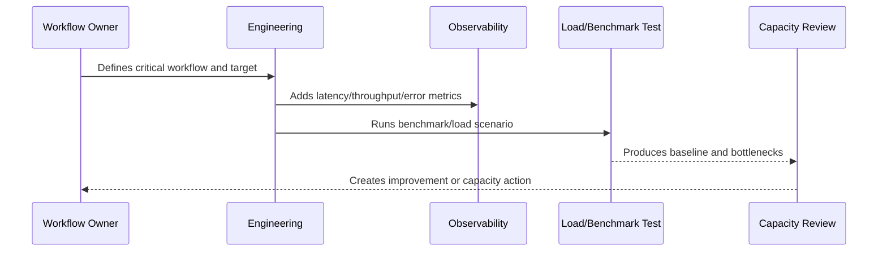

# Capacity Planning Model

> *"Defines how CLARA estimates, tracks, reviews, and plans capacity for traffic, users, workspaces, conversations, tickets, AI calls, integrations, queues, and storage."*

---

# Purpose

Defines how CLARA estimates, tracks, reviews, and plans capacity for traffic, users, workspaces, conversations, tickets, AI calls, integrations, queues, and storage.

---

# Performance Problem

Capacity problems appear suddenly when growth and limits are not tracked before production pressure.

---

# Performance Decision

## Decision

CLARA should plan capacity using current usage, growth assumptions, bottlenecks, limits, safety margins, and cost impact.

## Status

Accepted.

---

# Performance and Capacity Rule

Every critical CLARA workflow should be managed as:

```text
Workflow -> Performance Target -> Capacity Limit -> Bottleneck -> Monitoring -> Test Evidence -> Review Cadence -> Improvement Plan
```

A production workflow is not performance-ready if the team cannot answer:

```text
how fast it should be
how much load it can handle
what happens when load grows
where the bottleneck is likely
how to detect regression
how to test scale safely
how to reduce cost without breaking UX
```

---

# Recommended Performance Flow



---

# Production-Ready Checklist

- [ ] Critical workflow is identified.
- [ ] Latency target is defined.
- [ ] Throughput expectation is defined.
- [ ] Payload/data size assumptions are defined.
- [ ] Bottleneck hypothesis is documented.
- [ ] Metrics exist.
- [ ] Load/benchmark scenario exists where relevant.
- [ ] Capacity threshold is defined.
- [ ] Regression review path exists.
- [ ] Cost impact is considered.

---

# Acceptance Criteria

- [ ] Performance target is clear.
- [ ] Capacity assumptions are clear.
- [ ] Bottlenecks are observable.
- [ ] Load test or benchmark evidence exists where needed.
- [ ] Review cadence is defined.
- [ ] Security/privacy is not weakened by optimization.
- [ ] AI coding assistants can follow this safely.

---

# Anti-patterns

Avoid:

- Optimizing without a user-impact target.
- Loading huge lists without pagination.
- Missing database indexes on critical queries.
- High-cardinality metrics for IDs/emails.
- Caching sensitive data without access controls.
- Infinite queue concurrency.
- AI prompts with unnecessary context.
- Retrying provider calls so hard that cost explodes.
- Load testing against production without approval.
- Ignoring performance regression until customer complaints.

---

# Related Documents

- ../PART-05-Reliability-Engineering/README.md
- ../PART-03-Logging-and-Metrics/README.md
- ../PART-02-Observability-Strategy/README.md
- ../../BOOK-05-Engineering-Execution-Plan/PART-10-DevOps-and-Release-Execution/README.md
- ../../BOOK-06-Security-Governance-and-Compliance/PART-09-Secure-SDLC-Governance/README.md

---

# Navigation

**Previous:** `62-Performance-Principles.md`

**Next:** `64-API-Performance-Standards.md`

---

# Capacity Dimensions

Track capacity for:

```text
active users
organizations/workspaces
customers/contacts
conversations/messages
tickets
knowledge articles
AI requests
webhook events
queue jobs
attachments/storage
exports
database rows
provider/API rate limits
```

---

# Capacity Planning Template

```markdown
## Capacity Plan

Capability:
Current load:
Expected growth:
Peak load:
Known limits:
Bottleneck:
Safety margin:
Scaling strategy:
Monitoring:
Cost impact:
Review date:
```

---

# Capacity Rule

Capacity planning should include both technical limits and provider/vendor limits.
