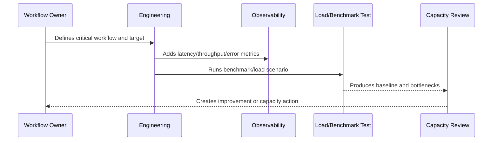

# Database Performance Standards

> *"Defines database performance standards for indexes, query design, pagination, transactions, connection pools, migrations, and slow query review."*

---

# Purpose

Defines database performance standards for indexes, query design, pagination, transactions, connection pools, migrations, and slow query review.

---

# Performance Problem

Most SaaS performance incidents eventually touch the database.

---

# Performance Decision

## Decision

CLARA database access should be query-aware, index-aware, scoped, observable, and tested against realistic data sizes.

## Status

Accepted.

---

# Performance and Capacity Rule

Every critical CLARA workflow should be managed as:

```text
Workflow -> Performance Target -> Capacity Limit -> Bottleneck -> Monitoring -> Test Evidence -> Review Cadence -> Improvement Plan
```

A production workflow is not performance-ready if the team cannot answer:

```text
how fast it should be
how much load it can handle
what happens when load grows
where the bottleneck is likely
how to detect regression
how to test scale safely
how to reduce cost without breaking UX
```

---

# Recommended Performance Flow



---

# Production-Ready Checklist

- [ ] Critical workflow is identified.
- [ ] Latency target is defined.
- [ ] Throughput expectation is defined.
- [ ] Payload/data size assumptions are defined.
- [ ] Bottleneck hypothesis is documented.
- [ ] Metrics exist.
- [ ] Load/benchmark scenario exists where relevant.
- [ ] Capacity threshold is defined.
- [ ] Regression review path exists.
- [ ] Cost impact is considered.

---

# Acceptance Criteria

- [ ] Performance target is clear.
- [ ] Capacity assumptions are clear.
- [ ] Bottlenecks are observable.
- [ ] Load test or benchmark evidence exists where needed.
- [ ] Review cadence is defined.
- [ ] Security/privacy is not weakened by optimization.
- [ ] AI coding assistants can follow this safely.

---

# Anti-patterns

Avoid:

- Optimizing without a user-impact target.
- Loading huge lists without pagination.
- Missing database indexes on critical queries.
- High-cardinality metrics for IDs/emails.
- Caching sensitive data without access controls.
- Infinite queue concurrency.
- AI prompts with unnecessary context.
- Retrying provider calls so hard that cost explodes.
- Load testing against production without approval.
- Ignoring performance regression until customer complaints.

---

# Related Documents

- ../PART-05-Reliability-Engineering/README.md
- ../PART-03-Logging-and-Metrics/README.md
- ../PART-02-Observability-Strategy/README.md
- ../../BOOK-05-Engineering-Execution-Plan/PART-10-DevOps-and-Release-Execution/README.md
- ../../BOOK-06-Security-Governance-and-Compliance/PART-09-Secure-SDLC-Governance/README.md

---

# Navigation

**Previous:** `64-API-Performance-Standards.md`

**Next:** `66-Frontend-Performance-Standards.md`

---

# Database Performance Standards

Use:

```text
indexes for critical filters/sorts
pagination for large result sets
query plan review for high-risk queries
transaction boundaries
connection pool monitoring
slow query logging
migration performance review
tenant/workspace scoping indexes
```

---

# Query Review Checklist

- [ ] Query uses expected index.
- [ ] Query is scoped by organization/workspace where required.
- [ ] Query avoids unnecessary joins.
- [ ] Query avoids N+1 patterns.
- [ ] Query has bounded result size.
- [ ] Query latency is observable.
- [ ] Migration impact is understood.

---

# Database Rule

Production database performance is a reliability concern, not only an optimization concern.
