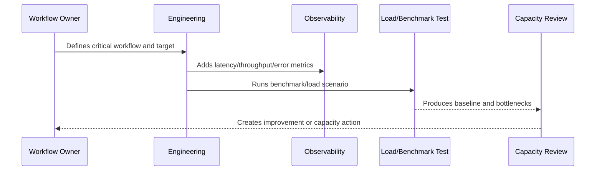

# Frontend Performance Standards

> *"Defines frontend performance standards for initial load, route transitions, rendering, data fetching, caching, bundle size, and perceived speed."*

---

# Purpose

Defines frontend performance standards for initial load, route transitions, rendering, data fetching, caching, bundle size, and perceived speed.

---

# Performance Problem

A backend can be fast while users still experience the product as slow.

---

# Performance Decision

## Decision

CLARA frontend should prioritize fast critical workflows, predictable loading states, efficient rendering, and safe data fetching.

## Status

Accepted.

---

# Performance and Capacity Rule

Every critical CLARA workflow should be managed as:

```text
Workflow -> Performance Target -> Capacity Limit -> Bottleneck -> Monitoring -> Test Evidence -> Review Cadence -> Improvement Plan
```

A production workflow is not performance-ready if the team cannot answer:

```text
how fast it should be
how much load it can handle
what happens when load grows
where the bottleneck is likely
how to detect regression
how to test scale safely
how to reduce cost without breaking UX
```

---

# Recommended Performance Flow



---

# Production-Ready Checklist

- [ ] Critical workflow is identified.
- [ ] Latency target is defined.
- [ ] Throughput expectation is defined.
- [ ] Payload/data size assumptions are defined.
- [ ] Bottleneck hypothesis is documented.
- [ ] Metrics exist.
- [ ] Load/benchmark scenario exists where relevant.
- [ ] Capacity threshold is defined.
- [ ] Regression review path exists.
- [ ] Cost impact is considered.

---

# Acceptance Criteria

- [ ] Performance target is clear.
- [ ] Capacity assumptions are clear.
- [ ] Bottlenecks are observable.
- [ ] Load test or benchmark evidence exists where needed.
- [ ] Review cadence is defined.
- [ ] Security/privacy is not weakened by optimization.
- [ ] AI coding assistants can follow this safely.

---

# Anti-patterns

Avoid:

- Optimizing without a user-impact target.
- Loading huge lists without pagination.
- Missing database indexes on critical queries.
- High-cardinality metrics for IDs/emails.
- Caching sensitive data without access controls.
- Infinite queue concurrency.
- AI prompts with unnecessary context.
- Retrying provider calls so hard that cost explodes.
- Load testing against production without approval.
- Ignoring performance regression until customer complaints.

---

# Related Documents

- ../PART-05-Reliability-Engineering/README.md
- ../PART-03-Logging-and-Metrics/README.md
- ../PART-02-Observability-Strategy/README.md
- ../../BOOK-05-Engineering-Execution-Plan/PART-10-DevOps-and-Release-Execution/README.md
- ../../BOOK-06-Security-Governance-and-Compliance/PART-09-Secure-SDLC-Governance/README.md

---

# Navigation

**Previous:** `65-Database-Performance-Standards.md`

**Next:** `67-Queue-Worker-and-Async-Throughput.md`

---

# Frontend Performance Areas

Track:

```text
initial load
route transition
critical interaction latency
API waterfall count
bundle size
render count
large table/list rendering
search responsiveness
attachment preview/download behavior
```

---

# Frontend Practices

Use:

```text
loading skeletons
pagination/virtualization for long lists
debounced search
client cache with scope awareness
avoid unnecessary re-renders
split bundles where useful
error/empty states
```

---

# UX Performance Rule

Perceived performance matters.

Users should know whether the system is loading, failed, or waiting for external processing.
