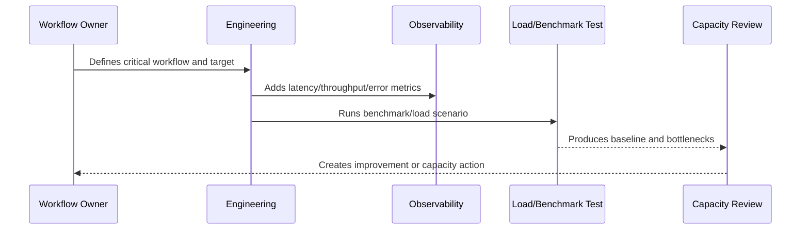

# Queue Worker and Async Throughput

> *"Defines throughput, concurrency, backlog, worker scaling, job duration, retry pressure, dead-letter handling, and async capacity planning."*

---

# Purpose

Defines throughput, concurrency, backlog, worker scaling, job duration, retry pressure, dead-letter handling, and async capacity planning.

---

# Performance Problem

Queue backlog can become customer-impacting even when APIs look healthy.

---

# Performance Decision

## Decision

CLARA queues and workers should be capacity-aware so async workflows do not silently fall behind under load.

## Status

Accepted.

---

# Performance and Capacity Rule

Every critical CLARA workflow should be managed as:

```text
Workflow -> Performance Target -> Capacity Limit -> Bottleneck -> Monitoring -> Test Evidence -> Review Cadence -> Improvement Plan
```

A production workflow is not performance-ready if the team cannot answer:

```text
how fast it should be
how much load it can handle
what happens when load grows
where the bottleneck is likely
how to detect regression
how to test scale safely
how to reduce cost without breaking UX
```

---

# Recommended Performance Flow



---

# Production-Ready Checklist

- [ ] Critical workflow is identified.
- [ ] Latency target is defined.
- [ ] Throughput expectation is defined.
- [ ] Payload/data size assumptions are defined.
- [ ] Bottleneck hypothesis is documented.
- [ ] Metrics exist.
- [ ] Load/benchmark scenario exists where relevant.
- [ ] Capacity threshold is defined.
- [ ] Regression review path exists.
- [ ] Cost impact is considered.

---

# Acceptance Criteria

- [ ] Performance target is clear.
- [ ] Capacity assumptions are clear.
- [ ] Bottlenecks are observable.
- [ ] Load test or benchmark evidence exists where needed.
- [ ] Review cadence is defined.
- [ ] Security/privacy is not weakened by optimization.
- [ ] AI coding assistants can follow this safely.

---

# Anti-patterns

Avoid:

- Optimizing without a user-impact target.
- Loading huge lists without pagination.
- Missing database indexes on critical queries.
- High-cardinality metrics for IDs/emails.
- Caching sensitive data without access controls.
- Infinite queue concurrency.
- AI prompts with unnecessary context.
- Retrying provider calls so hard that cost explodes.
- Load testing against production without approval.
- Ignoring performance regression until customer complaints.

---

# Related Documents

- ../PART-05-Reliability-Engineering/README.md
- ../PART-03-Logging-and-Metrics/README.md
- ../PART-02-Observability-Strategy/README.md
- ../../BOOK-05-Engineering-Execution-Plan/PART-10-DevOps-and-Release-Execution/README.md
- ../../BOOK-06-Security-Governance-and-Compliance/PART-09-Secure-SDLC-Governance/README.md

---

# Navigation

**Previous:** `66-Frontend-Performance-Standards.md`

**Next:** `68-AI-Latency-Cost-and-Throughput.md`

---

# Queue Capacity Signals

Track:

```text
queue_depth
oldest_message_age
job_duration
worker_concurrency
retry_count
dead_letter_count
worker_heartbeat
job_success_rate
job_failure_rate
```

---

# Throughput Planning

For each queue:

```text
expected jobs per minute
peak jobs per minute
average processing time
max acceptable delay
worker concurrency
retry policy
dead-letter policy
scaling behavior
```

---

# Queue Rule

A growing backlog is performance debt becoming reliability risk.
