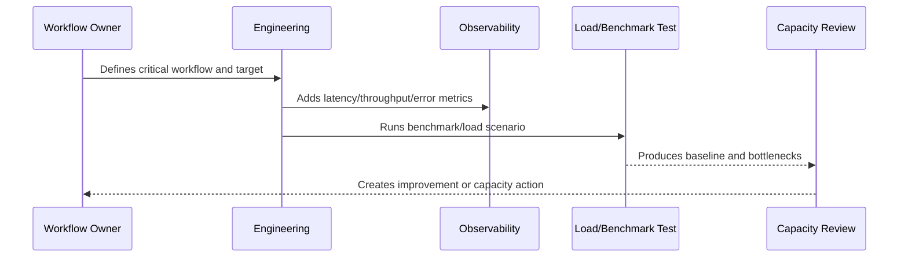

# Load Testing and Benchmarking

> *"Defines how CLARA performs load tests, stress tests, benchmark baselines, test data design, scenarios, and safe test execution."*

---

# Purpose

Defines how CLARA performs load tests, stress tests, benchmark baselines, test data design, scenarios, and safe test execution.

---

# Performance Problem

Performance assumptions are unreliable until tested under realistic load and data volume.

---

# Performance Decision

## Decision

CLARA should validate high-risk workflows with realistic benchmarks and load tests before scale-sensitive releases.

## Status

Accepted.

---

# Performance and Capacity Rule

Every critical CLARA workflow should be managed as:

```text
Workflow -> Performance Target -> Capacity Limit -> Bottleneck -> Monitoring -> Test Evidence -> Review Cadence -> Improvement Plan
```

A production workflow is not performance-ready if the team cannot answer:

```text
how fast it should be
how much load it can handle
what happens when load grows
where the bottleneck is likely
how to detect regression
how to test scale safely
how to reduce cost without breaking UX
```

---

# Recommended Performance Flow



---

# Production-Ready Checklist

- [ ] Critical workflow is identified.
- [ ] Latency target is defined.
- [ ] Throughput expectation is defined.
- [ ] Payload/data size assumptions are defined.
- [ ] Bottleneck hypothesis is documented.
- [ ] Metrics exist.
- [ ] Load/benchmark scenario exists where relevant.
- [ ] Capacity threshold is defined.
- [ ] Regression review path exists.
- [ ] Cost impact is considered.

---

# Acceptance Criteria

- [ ] Performance target is clear.
- [ ] Capacity assumptions are clear.
- [ ] Bottlenecks are observable.
- [ ] Load test or benchmark evidence exists where needed.
- [ ] Review cadence is defined.
- [ ] Security/privacy is not weakened by optimization.
- [ ] AI coding assistants can follow this safely.

---

# Anti-patterns

Avoid:

- Optimizing without a user-impact target.
- Loading huge lists without pagination.
- Missing database indexes on critical queries.
- High-cardinality metrics for IDs/emails.
- Caching sensitive data without access controls.
- Infinite queue concurrency.
- AI prompts with unnecessary context.
- Retrying provider calls so hard that cost explodes.
- Load testing against production without approval.
- Ignoring performance regression until customer complaints.

---

# Related Documents

- ../PART-05-Reliability-Engineering/README.md
- ../PART-03-Logging-and-Metrics/README.md
- ../PART-02-Observability-Strategy/README.md
- ../../BOOK-05-Engineering-Execution-Plan/PART-10-DevOps-and-Release-Execution/README.md
- ../../BOOK-06-Security-Governance-and-Compliance/PART-09-Secure-SDLC-Governance/README.md

---

# Navigation

**Previous:** `69-Integration-Throughput-and-Rate-Limits.md`

**Next:** `71-Performance-Budgets-and-Capacity-Review.md`

---

# Test Types

Use:

```text
benchmark test
load test
stress test
soak test
spike test
dependency failure simulation
queue backlog simulation
AI/provider latency simulation
```

---

# Load Test Scenario Template

```markdown
## Load Test Scenario

Workflow:
Purpose:
Data volume:
Concurrent users/events:
Duration:
Success criteria:
Failure criteria:
Metrics observed:
Result:
Bottlenecks:
Follow-up:
```

---

# Safety Rule

Do not run heavy load tests against production without explicit approval, isolation, and rollback/stop plan.
