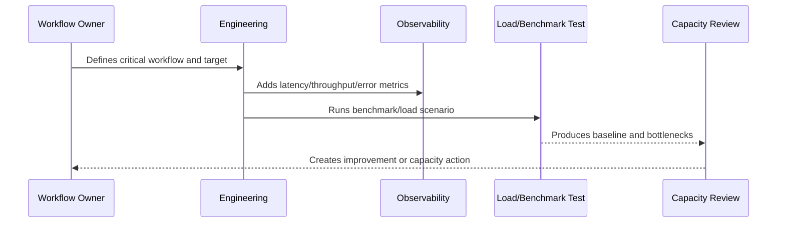

# Performance Budgets and Capacity Review

> *"Defines performance budgets, capacity review cadence, threshold tracking, regression gates, and operational reporting."*

---

# Purpose

Defines performance budgets, capacity review cadence, threshold tracking, regression gates, and operational reporting.

---

# Performance Problem

Performance regression becomes normal when no budget or review cadence exists.

---

# Performance Decision

## Decision

CLARA should set practical performance budgets for critical workflows and review capacity trends before they become incidents.

## Status

Accepted.

---

# Performance and Capacity Rule

Every critical CLARA workflow should be managed as:

```text
Workflow -> Performance Target -> Capacity Limit -> Bottleneck -> Monitoring -> Test Evidence -> Review Cadence -> Improvement Plan
```

A production workflow is not performance-ready if the team cannot answer:

```text
how fast it should be
how much load it can handle
what happens when load grows
where the bottleneck is likely
how to detect regression
how to test scale safely
how to reduce cost without breaking UX
```

---

# Recommended Performance Flow



---

# Production-Ready Checklist

- [ ] Critical workflow is identified.
- [ ] Latency target is defined.
- [ ] Throughput expectation is defined.
- [ ] Payload/data size assumptions are defined.
- [ ] Bottleneck hypothesis is documented.
- [ ] Metrics exist.
- [ ] Load/benchmark scenario exists where relevant.
- [ ] Capacity threshold is defined.
- [ ] Regression review path exists.
- [ ] Cost impact is considered.

---

# Acceptance Criteria

- [ ] Performance target is clear.
- [ ] Capacity assumptions are clear.
- [ ] Bottlenecks are observable.
- [ ] Load test or benchmark evidence exists where needed.
- [ ] Review cadence is defined.
- [ ] Security/privacy is not weakened by optimization.
- [ ] AI coding assistants can follow this safely.

---

# Anti-patterns

Avoid:

- Optimizing without a user-impact target.
- Loading huge lists without pagination.
- Missing database indexes on critical queries.
- High-cardinality metrics for IDs/emails.
- Caching sensitive data without access controls.
- Infinite queue concurrency.
- AI prompts with unnecessary context.
- Retrying provider calls so hard that cost explodes.
- Load testing against production without approval.
- Ignoring performance regression until customer complaints.

---

# Related Documents

- ../PART-05-Reliability-Engineering/README.md
- ../PART-03-Logging-and-Metrics/README.md
- ../PART-02-Observability-Strategy/README.md
- ../../BOOK-05-Engineering-Execution-Plan/PART-10-DevOps-and-Release-Execution/README.md
- ../../BOOK-06-Security-Governance-and-Compliance/PART-09-Secure-SDLC-Governance/README.md

---

# Navigation

**Previous:** `70-Load-Testing-and-Benchmarking.md`

**Next:** `72-Part-06-Summary.md`

---

# Performance Budgets

Define budgets for:

```text
API p95 latency
frontend route load
database slow query threshold
queue oldest job age
AI draft generation latency
integration processing latency
export generation time
attachment upload/download time
```

---

# Review Cadence

Recommended:

```text
weekly for active scale issues
monthly for core performance dashboard
quarterly for capacity planning
per release for performance-sensitive changes
after incident for performance-related failures
```

---

# Capacity Review Output

Each review should produce:

```text
current usage
trend
risk areas
budget breaches
capacity actions
owners
due dates
evidence links
```

---

# Budget Rule

Performance budgets should be treated as guardrails, not decoration.
