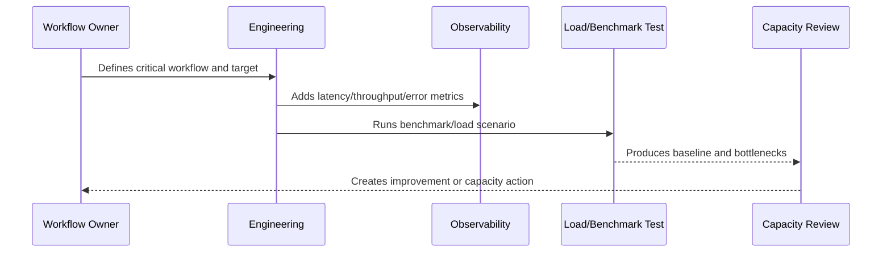

# Part 06 Summary

> *"Summarizes Performance and Capacity and prepares for Book VII Part 07."*

---

# Purpose

Summarizes Performance and Capacity and prepares for Book VII Part 07.

---

# Performance Problem

Backup and disaster recovery come next because performance and capacity planning must be paired with resilience and recoverability.

---

# Performance Decision

## Decision

CLARA should proceed to Backup, Restore, and Disaster Recovery after defining performance principles, capacity planning, API/database/frontend performance, queues, AI, integrations, load testing, and review cadence.

## Status

Accepted.

---

# Performance and Capacity Rule

Every critical CLARA workflow should be managed as:

```text
Workflow -> Performance Target -> Capacity Limit -> Bottleneck -> Monitoring -> Test Evidence -> Review Cadence -> Improvement Plan
```

A production workflow is not performance-ready if the team cannot answer:

```text
how fast it should be
how much load it can handle
what happens when load grows
where the bottleneck is likely
how to detect regression
how to test scale safely
how to reduce cost without breaking UX
```

---

# Recommended Performance Flow



---

# Production-Ready Checklist

- [ ] Critical workflow is identified.
- [ ] Latency target is defined.
- [ ] Throughput expectation is defined.
- [ ] Payload/data size assumptions are defined.
- [ ] Bottleneck hypothesis is documented.
- [ ] Metrics exist.
- [ ] Load/benchmark scenario exists where relevant.
- [ ] Capacity threshold is defined.
- [ ] Regression review path exists.
- [ ] Cost impact is considered.

---

# Acceptance Criteria

- [ ] Performance target is clear.
- [ ] Capacity assumptions are clear.
- [ ] Bottlenecks are observable.
- [ ] Load test or benchmark evidence exists where needed.
- [ ] Review cadence is defined.
- [ ] Security/privacy is not weakened by optimization.
- [ ] AI coding assistants can follow this safely.

---

# Anti-patterns

Avoid:

- Optimizing without a user-impact target.
- Loading huge lists without pagination.
- Missing database indexes on critical queries.
- High-cardinality metrics for IDs/emails.
- Caching sensitive data without access controls.
- Infinite queue concurrency.
- AI prompts with unnecessary context.
- Retrying provider calls so hard that cost explodes.
- Load testing against production without approval.
- Ignoring performance regression until customer complaints.

---

# Related Documents

- ../PART-05-Reliability-Engineering/README.md
- ../PART-03-Logging-and-Metrics/README.md
- ../PART-02-Observability-Strategy/README.md
- ../../BOOK-05-Engineering-Execution-Plan/PART-10-DevOps-and-Release-Execution/README.md
- ../../BOOK-06-Security-Governance-and-Compliance/PART-09-Secure-SDLC-Governance/README.md

---

# Navigation

**Previous:** `71-Performance-Budgets-and-Capacity-Review.md`

**Next:** `../PART-07-Backup-Restore-and-Disaster-Recovery/README.md`

---

# Part 06 Completion

Part 06 establishes:

- Performance and capacity overview.
- Performance principles.
- Capacity planning model.
- API performance standards.
- Database performance standards.
- Frontend performance standards.
- Queue worker and async throughput.
- AI latency, cost, and throughput.
- Integration throughput and rate limits.
- Load testing and benchmarking.
- Performance budgets and capacity review.

---

# Ready for Part 07

The next part should be:

```text
BOOK VII — PART 07: Backup, Restore, and Disaster Recovery
```

It should define:

- Backup principles.
- Data protection and recovery scope.
- Backup strategy.
- Restore testing.
- RTO/RPO.
- Database restore.
- File/object restore.
- Disaster recovery scenarios.
- Recovery runbooks.
- DR evidence and review cadence.
