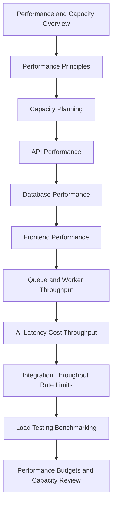

# PART-06 — Performance and Capacity

> *"Performance is not only speed. Performance is the system's ability to keep serving users as reality grows."*

---

# Purpose

Part 06 defines CLARA's performance and capacity model.

It covers:

- Performance and Capacity overview.
- Performance Principles.
- Capacity Planning Model.
- API Performance Standards.
- Database Performance Standards.
- Frontend Performance Standards.
- Queue Worker and Async Throughput.
- AI Latency Cost and Throughput.
- Integration Throughput and Rate Limits.
- Load Testing and Benchmarking.
- Performance Budgets and Capacity Review.

---

# Chapter Map

| Chapter | Title |
|---:|---|
| 61 | Performance and Capacity Overview |
| 62 | Performance Principles |
| 63 | Capacity Planning Model |
| 64 | API Performance Standards |
| 65 | Database Performance Standards |
| 66 | Frontend Performance Standards |
| 67 | Queue Worker and Async Throughput |
| 68 | AI Latency Cost and Throughput |
| 69 | Integration Throughput and Rate Limits |
| 70 | Load Testing and Benchmarking |
| 71 | Performance Budgets and Capacity Review |
| 72 | Part 06 Summary |

---

# Performance and Capacity Map



---

# Performance Non-Negotiables

CLARA performance and capacity must enforce:

```text
critical workflow performance targets
bounded API payloads
pagination for list endpoints
database indexes for critical queries
slow query review
frontend loading states
queue backlog monitoring
bounded retries and concurrency
AI latency/cost monitoring
integration rate-limit handling
load testing for risky scale changes
capacity review cadence
performance regression evidence
```

---

# Relationship to Previous Parts

Part 05 defines reliability engineering.

Part 06 defines how CLARA prevents latency, saturation, throughput limits, and capacity issues from becoming reliability incidents.

---

# Navigation

**Previous:** `../PART-05-Reliability-Engineering/60-Part-05-Summary.md`

**Next:** `61-Performance-and-Capacity-Overview.md`
