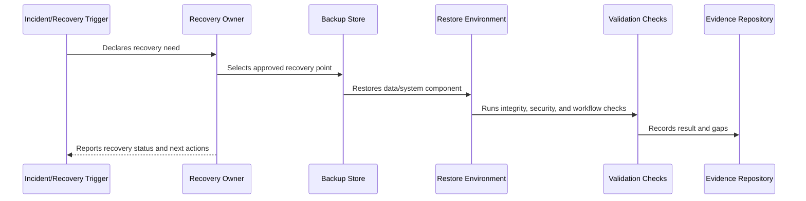

# Backup Restore and Disaster Recovery Overview

> *"Introduces CLARA's backup, restore, and disaster recovery model for protecting production data, restoring service, and recovering from severe operational failures."*

---

# Purpose

Introduces CLARA's backup, restore, and disaster recovery model for protecting production data, restoring service, and recovering from severe operational failures.

---

# Recovery Problem

A backup that cannot be restored under pressure is not a recovery capability.

---

# Recovery Decision

## Decision

CLARA should treat backup, restore, and disaster recovery as tested operational capabilities, not as assumptions.

## Status

Accepted.

---

# Backup and Recovery Rule

Every critical CLARA data/system component must be governed as:

```text
Component -> Criticality -> Backup Method -> Retention -> RTO/RPO -> Restore Procedure -> Validation -> Evidence -> Review Cadence
```

A recovery plan is incomplete if the team cannot answer:

```text
what must be recovered
where backup lives
who can access it
how to restore it
how long restore should take
how much data loss is acceptable
how to validate restore
how to communicate recovery status
how evidence is retained
```

---

# Recommended Recovery Flow



---

# Production-Ready Checklist

- [ ] Component/data class is identified.
- [ ] Criticality is defined.
- [ ] Backup method is defined.
- [ ] Retention is defined.
- [ ] Access control is defined.
- [ ] Encryption is defined.
- [ ] RTO/RPO is defined.
- [ ] Restore procedure exists.
- [ ] Restore validation exists.
- [ ] Evidence and review cadence are defined.

---

# Acceptance Criteria

- [ ] Recovery scope is clear.
- [ ] Backup strategy is clear.
- [ ] Restore procedure is actionable.
- [ ] Validation steps are clear.
- [ ] Security/privacy requirements are clear.
- [ ] Evidence expectations are clear.
- [ ] AI coding assistants can follow this safely.

---

# Anti-patterns

Avoid:

- Assuming backups work without restore tests.
- Storing backups without encryption.
- Giving broad backup access to many people.
- Keeping backups forever without retention decision.
- Backing up database but not file metadata.
- Restoring data into wrong tenant/workspace context.
- Hard-coding secrets in recovery docs.
- Running restore directly on production without a tested plan.
- No RTO/RPO target.
- No recovery evidence.

---

# Related Documents

- ../PART-05-Reliability-Engineering/README.md
- ../PART-06-Performance-and-Capacity/README.md
- ../PART-04-Alerting-and-Incident-Operations/README.md
- ../../BOOK-06-Security-Governance-and-Compliance/PART-08-Incident-Response-and-Business-Continuity-Governance/95-Business-Continuity-and-Disaster-Recovery-Governance.md
- ../../BOOK-06-Security-Governance-and-Compliance/PART-04-Data-Protection-and-Privacy-Governance/README.md

---

# Navigation

**Previous:** `../PART-06-Performance-and-Capacity/72-Part-06-Summary.md`

**Next:** `74-Backup-Principles.md`

---

# Recovery Scope

CLARA recovery covers:

```text
primary database
audit/event data
object/file storage
attachments
exports
configuration
infrastructure definitions
deployment pipelines
queue state where recoverable
integration state
AI Gateway configuration and prompt versions
observability and operational evidence
```

---

# Core Recovery Questions

```text
What data is critical?
How often is it backed up?
Can it be restored?
How do we validate integrity?
How do we protect restored data?
Who approves recovery?
How do we communicate recovery state?
```
