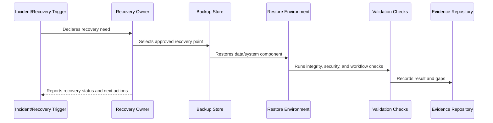

# Restore Testing and Validation

> *"Defines restore testing process, validation checks, test environments, evidence capture, and failure handling."*

---

# Purpose

Defines restore testing process, validation checks, test environments, evidence capture, and failure handling.

---

# Recovery Problem

Backup success logs do not prove restore success.

---

# Recovery Decision

## Decision

CLARA should regularly test restore procedures and validate that restored data is complete, consistent, secure, and usable.

## Status

Accepted.

---

# Backup and Recovery Rule

Every critical CLARA data/system component must be governed as:

```text
Component -> Criticality -> Backup Method -> Retention -> RTO/RPO -> Restore Procedure -> Validation -> Evidence -> Review Cadence
```

A recovery plan is incomplete if the team cannot answer:

```text
what must be recovered
where backup lives
who can access it
how to restore it
how long restore should take
how much data loss is acceptable
how to validate restore
how to communicate recovery status
how evidence is retained
```

---

# Recommended Recovery Flow



---

# Production-Ready Checklist

- [ ] Component/data class is identified.
- [ ] Criticality is defined.
- [ ] Backup method is defined.
- [ ] Retention is defined.
- [ ] Access control is defined.
- [ ] Encryption is defined.
- [ ] RTO/RPO is defined.
- [ ] Restore procedure exists.
- [ ] Restore validation exists.
- [ ] Evidence and review cadence are defined.

---

# Acceptance Criteria

- [ ] Recovery scope is clear.
- [ ] Backup strategy is clear.
- [ ] Restore procedure is actionable.
- [ ] Validation steps are clear.
- [ ] Security/privacy requirements are clear.
- [ ] Evidence expectations are clear.
- [ ] AI coding assistants can follow this safely.

---

# Anti-patterns

Avoid:

- Assuming backups work without restore tests.
- Storing backups without encryption.
- Giving broad backup access to many people.
- Keeping backups forever without retention decision.
- Backing up database but not file metadata.
- Restoring data into wrong tenant/workspace context.
- Hard-coding secrets in recovery docs.
- Running restore directly on production without a tested plan.
- No RTO/RPO target.
- No recovery evidence.

---

# Related Documents

- ../PART-05-Reliability-Engineering/README.md
- ../PART-06-Performance-and-Capacity/README.md
- ../PART-04-Alerting-and-Incident-Operations/README.md
- ../../BOOK-06-Security-Governance-and-Compliance/PART-08-Incident-Response-and-Business-Continuity-Governance/95-Business-Continuity-and-Disaster-Recovery-Governance.md
- ../../BOOK-06-Security-Governance-and-Compliance/PART-04-Data-Protection-and-Privacy-Governance/README.md

---

# Navigation

**Previous:** `76-Backup-Strategy-and-Schedule.md`

**Next:** `78-RTO-and-RPO-Model.md`

---

# Restore Test Types

Use:

```text
database restore test
point-in-time restore test
file/object restore test
configuration recovery test
environment bootstrap test
partial workflow recovery test
full disaster recovery exercise
```

---

# Restore Validation Checklist

- [ ] Restore completed successfully.
- [ ] Data integrity checked.
- [ ] Tenant/workspace boundaries preserved.
- [ ] Critical queries work.
- [ ] Critical workflows pass smoke tests.
- [ ] File references resolve.
- [ ] Permissions are correct.
- [ ] Secrets are not exposed.
- [ ] Logs/evidence captured.
- [ ] Issues are tracked.

---

# Restore Rule

A backup is not trusted until restore has been tested and validated.
