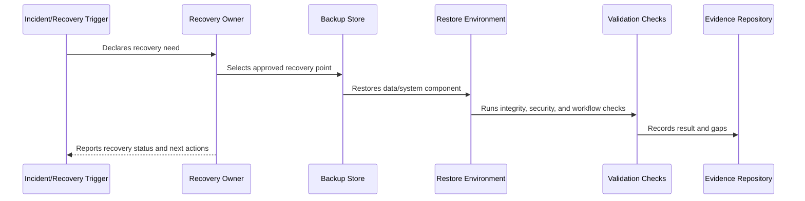

# File Object Storage and Attachment Restore

> *"Defines backup and restore expectations for object storage, attachments, generated files, exports, media, and file metadata."*

---

# Purpose

Defines backup and restore expectations for object storage, attachments, generated files, exports, media, and file metadata.

---

# Recovery Problem

Files and database metadata can drift if restore plans do not handle them together.

---

# Recovery Decision

## Decision

CLARA file recovery should preserve authorization boundaries, metadata consistency, retention rules, and data integrity.

## Status

Accepted.

---

# Backup and Recovery Rule

Every critical CLARA data/system component must be governed as:

```text
Component -> Criticality -> Backup Method -> Retention -> RTO/RPO -> Restore Procedure -> Validation -> Evidence -> Review Cadence
```

A recovery plan is incomplete if the team cannot answer:

```text
what must be recovered
where backup lives
who can access it
how to restore it
how long restore should take
how much data loss is acceptable
how to validate restore
how to communicate recovery status
how evidence is retained
```

---

# Recommended Recovery Flow



---

# Production-Ready Checklist

- [ ] Component/data class is identified.
- [ ] Criticality is defined.
- [ ] Backup method is defined.
- [ ] Retention is defined.
- [ ] Access control is defined.
- [ ] Encryption is defined.
- [ ] RTO/RPO is defined.
- [ ] Restore procedure exists.
- [ ] Restore validation exists.
- [ ] Evidence and review cadence are defined.

---

# Acceptance Criteria

- [ ] Recovery scope is clear.
- [ ] Backup strategy is clear.
- [ ] Restore procedure is actionable.
- [ ] Validation steps are clear.
- [ ] Security/privacy requirements are clear.
- [ ] Evidence expectations are clear.
- [ ] AI coding assistants can follow this safely.

---

# Anti-patterns

Avoid:

- Assuming backups work without restore tests.
- Storing backups without encryption.
- Giving broad backup access to many people.
- Keeping backups forever without retention decision.
- Backing up database but not file metadata.
- Restoring data into wrong tenant/workspace context.
- Hard-coding secrets in recovery docs.
- Running restore directly on production without a tested plan.
- No RTO/RPO target.
- No recovery evidence.

---

# Related Documents

- ../PART-05-Reliability-Engineering/README.md
- ../PART-06-Performance-and-Capacity/README.md
- ../PART-04-Alerting-and-Incident-Operations/README.md
- ../../BOOK-06-Security-Governance-and-Compliance/PART-08-Incident-Response-and-Business-Continuity-Governance/95-Business-Continuity-and-Disaster-Recovery-Governance.md
- ../../BOOK-06-Security-Governance-and-Compliance/PART-04-Data-Protection-and-Privacy-Governance/README.md

---

# Navigation

**Previous:** `79-Database-Backup-and-Restore.md`

**Next:** `81-Configuration-Secrets-and-Infrastructure-Recovery.md`

---

# File/Object Recovery Requirements

Protect:

```text
attachments
uploaded media
generated exports
knowledge files
import files
conversation media references
file metadata
object keys
storage access policies
```

---

# Restore Consistency

File restore should validate:

```text
database metadata matches object storage
object exists
checksum/hash where available
permission model still applies
tenant/workspace isolation preserved
retention/deletion rules respected
download/preview workflow works
```

---

# File Recovery Rule

Restoring files without matching metadata can create broken references or data exposure risk.
