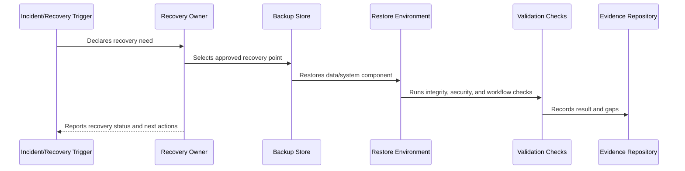

# Configuration Secrets and Infrastructure Recovery

> *"Defines recovery for environment configuration, infrastructure-as-code, secrets references, deployment settings, DNS, CI/CD, and operational tooling."*

---

# Purpose

Defines recovery for environment configuration, infrastructure-as-code, secrets references, deployment settings, DNS, CI/CD, and operational tooling.

---

# Recovery Problem

A database backup alone cannot restore production if infrastructure, secrets, DNS, and deployment configuration are missing.

---

# Recovery Decision

## Decision

CLARA infrastructure recovery should rely on versioned configuration, secret manager references, documented bootstrap steps, and least-privilege recovery access.

## Status

Accepted.

---

# Backup and Recovery Rule

Every critical CLARA data/system component must be governed as:

```text
Component -> Criticality -> Backup Method -> Retention -> RTO/RPO -> Restore Procedure -> Validation -> Evidence -> Review Cadence
```

A recovery plan is incomplete if the team cannot answer:

```text
what must be recovered
where backup lives
who can access it
how to restore it
how long restore should take
how much data loss is acceptable
how to validate restore
how to communicate recovery status
how evidence is retained
```

---

# Recommended Recovery Flow



---

# Production-Ready Checklist

- [ ] Component/data class is identified.
- [ ] Criticality is defined.
- [ ] Backup method is defined.
- [ ] Retention is defined.
- [ ] Access control is defined.
- [ ] Encryption is defined.
- [ ] RTO/RPO is defined.
- [ ] Restore procedure exists.
- [ ] Restore validation exists.
- [ ] Evidence and review cadence are defined.

---

# Acceptance Criteria

- [ ] Recovery scope is clear.
- [ ] Backup strategy is clear.
- [ ] Restore procedure is actionable.
- [ ] Validation steps are clear.
- [ ] Security/privacy requirements are clear.
- [ ] Evidence expectations are clear.
- [ ] AI coding assistants can follow this safely.

---

# Anti-patterns

Avoid:

- Assuming backups work without restore tests.
- Storing backups without encryption.
- Giving broad backup access to many people.
- Keeping backups forever without retention decision.
- Backing up database but not file metadata.
- Restoring data into wrong tenant/workspace context.
- Hard-coding secrets in recovery docs.
- Running restore directly on production without a tested plan.
- No RTO/RPO target.
- No recovery evidence.

---

# Related Documents

- ../PART-05-Reliability-Engineering/README.md
- ../PART-06-Performance-and-Capacity/README.md
- ../PART-04-Alerting-and-Incident-Operations/README.md
- ../../BOOK-06-Security-Governance-and-Compliance/PART-08-Incident-Response-and-Business-Continuity-Governance/95-Business-Continuity-and-Disaster-Recovery-Governance.md
- ../../BOOK-06-Security-Governance-and-Compliance/PART-04-Data-Protection-and-Privacy-Governance/README.md

---

# Navigation

**Previous:** `80-File-Object-Storage-and-Attachment-Restore.md`

**Next:** `82-Disaster-Recovery-Scenarios-and-Failover.md`

---

# Recoverable Operational Assets

Track recovery for:

```text
infrastructure-as-code
environment configuration
secret manager references
deployment pipeline config
DNS and routing config
monitoring/alert config
feature flag config
AI Gateway config
integration provider config
runbooks
```

---

# Secrets Recovery Rule

Do not store raw secrets in recovery documentation.

Document:

```text
secret name/reference
owner
rotation process
access path
recovery dependency
```

---

# Bootstrap Checklist

- [ ] Infrastructure definitions available.
- [ ] Secret manager access approved.
- [ ] Deployment pipeline recoverable.
- [ ] DNS/routing steps documented.
- [ ] Monitoring restored.
- [ ] Feature flags restored.
- [ ] Runbooks accessible.
