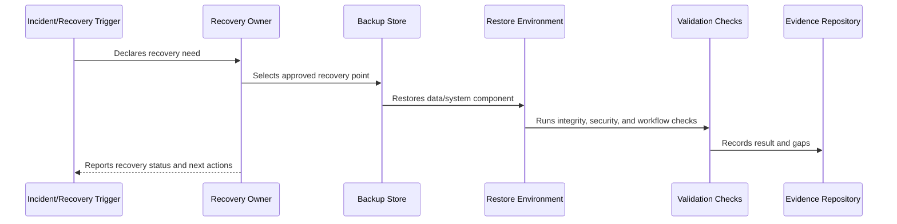

# Part 07 Summary

> *"Summarizes Backup, Restore, and Disaster Recovery and prepares for Book VII Part 08."*

---

# Purpose

Summarizes Backup, Restore, and Disaster Recovery and prepares for Book VII Part 08.

---

# Recovery Problem

Production support operations come next because recovery capability must connect to customer support, escalation, and operational communication.

---

# Recovery Decision

## Decision

CLARA should proceed to Production Support Operations after defining backup principles, recovery scope, backup schedules, restore validation, RTO/RPO, database restore, file restore, infrastructure recovery, DR scenarios, and recovery runbooks.

## Status

Accepted.

---

# Backup and Recovery Rule

Every critical CLARA data/system component must be governed as:

```text
Component -> Criticality -> Backup Method -> Retention -> RTO/RPO -> Restore Procedure -> Validation -> Evidence -> Review Cadence
```

A recovery plan is incomplete if the team cannot answer:

```text
what must be recovered
where backup lives
who can access it
how to restore it
how long restore should take
how much data loss is acceptable
how to validate restore
how to communicate recovery status
how evidence is retained
```

---

# Recommended Recovery Flow



---

# Production-Ready Checklist

- [ ] Component/data class is identified.
- [ ] Criticality is defined.
- [ ] Backup method is defined.
- [ ] Retention is defined.
- [ ] Access control is defined.
- [ ] Encryption is defined.
- [ ] RTO/RPO is defined.
- [ ] Restore procedure exists.
- [ ] Restore validation exists.
- [ ] Evidence and review cadence are defined.

---

# Acceptance Criteria

- [ ] Recovery scope is clear.
- [ ] Backup strategy is clear.
- [ ] Restore procedure is actionable.
- [ ] Validation steps are clear.
- [ ] Security/privacy requirements are clear.
- [ ] Evidence expectations are clear.
- [ ] AI coding assistants can follow this safely.

---

# Anti-patterns

Avoid:

- Assuming backups work without restore tests.
- Storing backups without encryption.
- Giving broad backup access to many people.
- Keeping backups forever without retention decision.
- Backing up database but not file metadata.
- Restoring data into wrong tenant/workspace context.
- Hard-coding secrets in recovery docs.
- Running restore directly on production without a tested plan.
- No RTO/RPO target.
- No recovery evidence.

---

# Related Documents

- ../PART-05-Reliability-Engineering/README.md
- ../PART-06-Performance-and-Capacity/README.md
- ../PART-04-Alerting-and-Incident-Operations/README.md
- ../../BOOK-06-Security-Governance-and-Compliance/PART-08-Incident-Response-and-Business-Continuity-Governance/95-Business-Continuity-and-Disaster-Recovery-Governance.md
- ../../BOOK-06-Security-Governance-and-Compliance/PART-04-Data-Protection-and-Privacy-Governance/README.md

---

# Navigation

**Previous:** `83-Recovery-Runbooks-Evidence-and-Review-Cadence.md`

**Next:** `../PART-08-Production-Support-Operations/README.md`

---

# Part 07 Completion

Part 07 establishes:

- Backup, restore, and disaster recovery overview.
- Backup principles.
- Data protection and recovery scope.
- Backup strategy and schedule.
- Restore testing and validation.
- RTO and RPO model.
- Database backup and restore.
- File/object storage and attachment restore.
- Configuration, secrets, and infrastructure recovery.
- Disaster recovery scenarios and failover.
- Recovery runbooks, evidence, and review cadence.

---

# Ready for Part 08

The next part should be:

```text
BOOK VII — PART 08: Production Support Operations
```

It should define:

- Support operations model.
- Support escalation.
- Customer impact triage.
- Support tooling.
- Incident-to-support coordination.
- Known issues management.
- Customer communication operations.
- Support evidence and reporting.
- Feedback loop to product/engineering.
- Support readiness checklist.
