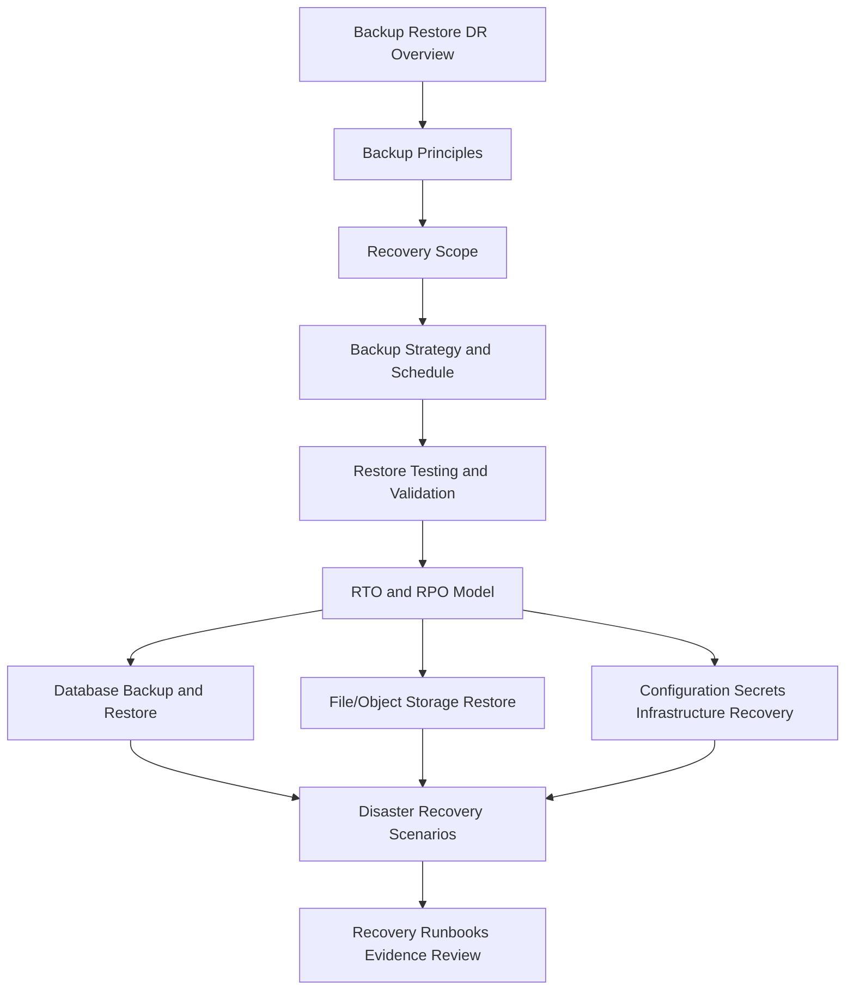

# PART-07 — Backup, Restore, and Disaster Recovery

> *"Backup is a file. Recovery is an operational capability."*

---

# Purpose

Part 07 defines CLARA's backup, restore, and disaster recovery model.

It covers:

- Backup Restore and Disaster Recovery overview.
- Backup Principles.
- Data Protection and Recovery Scope.
- Backup Strategy and Schedule.
- Restore Testing and Validation.
- RTO and RPO Model.
- Database Backup and Restore.
- File Object Storage and Attachment Restore.
- Configuration, Secrets, and Infrastructure Recovery.
- Disaster Recovery Scenarios and Failover.
- Recovery Runbooks, Evidence, and Review Cadence.

---

# Chapter Map

| Chapter | Title |
|---:|---|
| 73 | Backup Restore and Disaster Recovery Overview |
| 74 | Backup Principles |
| 75 | Data Protection and Recovery Scope |
| 76 | Backup Strategy and Schedule |
| 77 | Restore Testing and Validation |
| 78 | RTO and RPO Model |
| 79 | Database Backup and Restore |
| 80 | File Object Storage and Attachment Restore |
| 81 | Configuration Secrets and Infrastructure Recovery |
| 82 | Disaster Recovery Scenarios and Failover |
| 83 | Recovery Runbooks Evidence and Review Cadence |
| 84 | Part 07 Summary |

---

# Backup and Recovery Map



---

# Recovery Non-Negotiables

CLARA backup and recovery must enforce:

```text
defined recovery scope
encrypted backups
access-controlled backups
separate backup storage where practical
backup retention policy
restore testing
RTO/RPO targets
database restore validation
file/object restore validation
configuration and infrastructure recovery plan
secrets managed through secret manager references
DR scenarios and decision rules
recovery runbooks
evidence of restore tests
review cadence
```

---

# Relationship to Previous Parts

Part 05 defines reliability engineering.

Part 06 defines performance and capacity.

Part 07 defines how CLARA recovers when systems, data, infrastructure, or dependencies fail severely.

---

# Navigation

**Previous:** `../PART-06-Performance-and-Capacity/72-Part-06-Summary.md`

**Next:** `73-Backup-Restore-and-Disaster-Recovery-Overview.md`
