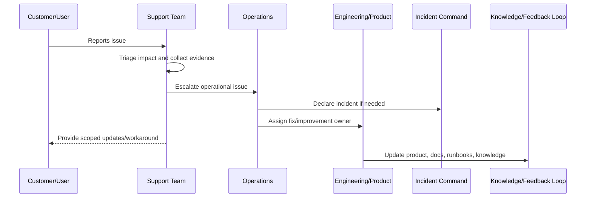

# Production Support Operations Overview

> *"Introduces CLARA's production support operations model for connecting customer issues, support workflows, engineering escalation, operational evidence, and product improvement."*

---

# Purpose

Introduces CLARA's production support operations model for connecting customer issues, support workflows, engineering escalation, operational evidence, and product improvement.

---

# Support Problem

Production issues are often first discovered through customer pain, so support operations must be part of the reliability system.

---

# Support Decision

## Decision

CLARA should operate production support as a structured bridge between customer reality and engineering response.

## Status

Accepted.

---

# Production Support Rule

Every production support issue should be handled as:

```text
Intake -> Triage -> Evidence -> Owner -> Escalation/Resolution -> Customer Update -> Closure -> Feedback Loop
```

A support workflow is incomplete if the team cannot answer:

```text
who is affected
what workflow is blocked
what evidence supports the issue
who owns resolution
whether this is an incident
what can be safely communicated
what workaround exists
what product/engineering improvement is needed
```

---

# Recommended Support Flow



---

# Production-Ready Checklist

- [ ] Intake channel is defined.
- [ ] Triage criteria are defined.
- [ ] Severity/priority model is defined.
- [ ] Evidence requirements are defined.
- [ ] Escalation path exists.
- [ ] Customer communication boundary is clear.
- [ ] Support tooling access is least-privilege.
- [ ] Sensitive support actions are audited.
- [ ] Known issue/workaround process exists.
- [ ] Feedback loop to product/engineering exists.

---

# Acceptance Criteria

- [ ] Support process is clear.
- [ ] Customer impact triage is clear.
- [ ] Escalation ownership is clear.
- [ ] Security/privacy boundaries are clear.
- [ ] Customer communication expectations are clear.
- [ ] Reporting and feedback loop are clear.
- [ ] AI coding assistants can follow this safely.

---

# Anti-patterns

Avoid:

- Support investigating production issues with no evidence standard.
- Sharing unverified incident assumptions with customers.
- Giving broad production database access to support.
- Support impersonation without audit and approval.
- Workarounds that bypass authorization or privacy controls.
- Escalations that say only “it is broken” with no context.
- Closing support tickets without linking known issues or follow-up work.
- Hiding recurring support pain from product and engineering.
- Treating AI/integration complaints as random user confusion.
- Launching features before support is trained.

---

# Related Documents

- ../PART-04-Alerting-and-Incident-Operations/README.md
- ../PART-07-Backup-Restore-and-Disaster-Recovery/README.md
- ../PART-01-Operations-Foundation/README.md
- ../../BOOK-06-Security-Governance-and-Compliance/PART-08-Incident-Response-and-Business-Continuity-Governance/README.md
- ../../BOOK-05-Engineering-Execution-Plan/PART-12-Production-Readiness-and-Handover/README.md

---

# Navigation

**Previous:** `../PART-07-Backup-Restore-and-Disaster-Recovery/84-Part-07-Summary.md`

**Next:** `86-Support-Operating-Model.md`

---

# Support Operations Scope

CLARA production support covers:

```text
customer-reported bugs
workflow failures
integration/provider issues
AI output or latency issues
login/access issues
data/export problems
attachment/file issues
performance complaints
incident customer updates
known issue management
workaround guidance
escalation to engineering/product/security
```

---

# Core Support Questions

```text
Is the customer blocked?
Is data/security/privacy involved?
Is this isolated or widespread?
Can support reproduce it?
What evidence exists?
Is there a safe workaround?
Who owns resolution?
Should this become an incident?
```
