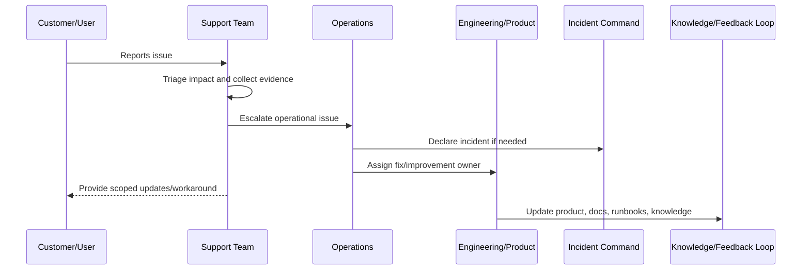

# Customer Impact Triage

> *"Defines how CLARA evaluates customer impact, urgency, severity, affected scope, workaround availability, and escalation need."*

---

# Purpose

Defines how CLARA evaluates customer impact, urgency, severity, affected scope, workaround availability, and escalation need.

---

# Support Problem

Not all support issues are equal; poor triage causes critical customer-impacting problems to wait behind low-risk noise.

---

# Support Decision

## Decision

CLARA support triage should prioritize issues by customer impact, data/security risk, workflow blockage, recurrence, and business criticality.

## Status

Accepted.

---

# Production Support Rule

Every production support issue should be handled as:

```text
Intake -> Triage -> Evidence -> Owner -> Escalation/Resolution -> Customer Update -> Closure -> Feedback Loop
```

A support workflow is incomplete if the team cannot answer:

```text
who is affected
what workflow is blocked
what evidence supports the issue
who owns resolution
whether this is an incident
what can be safely communicated
what workaround exists
what product/engineering improvement is needed
```

---

# Recommended Support Flow



---

# Production-Ready Checklist

- [ ] Intake channel is defined.
- [ ] Triage criteria are defined.
- [ ] Severity/priority model is defined.
- [ ] Evidence requirements are defined.
- [ ] Escalation path exists.
- [ ] Customer communication boundary is clear.
- [ ] Support tooling access is least-privilege.
- [ ] Sensitive support actions are audited.
- [ ] Known issue/workaround process exists.
- [ ] Feedback loop to product/engineering exists.

---

# Acceptance Criteria

- [ ] Support process is clear.
- [ ] Customer impact triage is clear.
- [ ] Escalation ownership is clear.
- [ ] Security/privacy boundaries are clear.
- [ ] Customer communication expectations are clear.
- [ ] Reporting and feedback loop are clear.
- [ ] AI coding assistants can follow this safely.

---

# Anti-patterns

Avoid:

- Support investigating production issues with no evidence standard.
- Sharing unverified incident assumptions with customers.
- Giving broad production database access to support.
- Support impersonation without audit and approval.
- Workarounds that bypass authorization or privacy controls.
- Escalations that say only “it is broken” with no context.
- Closing support tickets without linking known issues or follow-up work.
- Hiding recurring support pain from product and engineering.
- Treating AI/integration complaints as random user confusion.
- Launching features before support is trained.

---

# Related Documents

- ../PART-04-Alerting-and-Incident-Operations/README.md
- ../PART-07-Backup-Restore-and-Disaster-Recovery/README.md
- ../PART-01-Operations-Foundation/README.md
- ../../BOOK-06-Security-Governance-and-Compliance/PART-08-Incident-Response-and-Business-Continuity-Governance/README.md
- ../../BOOK-05-Engineering-Execution-Plan/PART-12-Production-Readiness-and-Handover/README.md

---

# Navigation

**Previous:** `86-Support-Operating-Model.md`

**Next:** `88-Support-Escalation-Workflow.md`

---

# Customer Impact Factors

Assess:

```text
number of users affected
critical workflow blocked
customer tier/business importance
data/security/privacy risk
duration
frequency/recurrence
workaround availability
provider dependency
AI/integration involvement
```

---

# Impact Levels

| Impact | Meaning |
|---|---|
| Critical | Major customer workflow blocked or data/security risk possible |
| High | Significant degradation with limited workaround |
| Medium | Partial issue with workaround |
| Low | Minor issue, question, cosmetic, or low-risk confusion |

---

# Triage Rule

When customer impact and data/security risk are unclear, escalate early and downgrade later with evidence.
