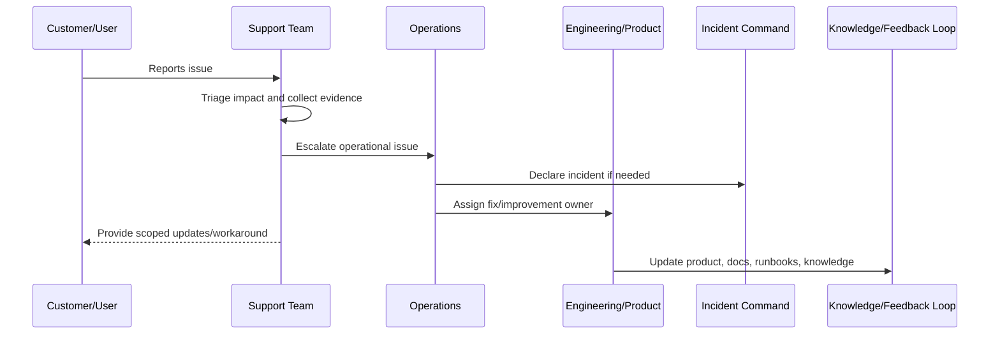

# Support Escalation Workflow

> *"Defines escalation from support to engineering, operations, product, security, AI owners, integration owners, and incident command."*

---

# Purpose

Defines escalation from support to engineering, operations, product, security, AI owners, integration owners, and incident command.

---

# Support Problem

Escalation without enough context wastes engineering time and slows customer recovery.

---

# Support Decision

## Decision

CLARA escalations should be structured, evidence-backed, routed to the right owner, and tracked until resolution or handoff.

## Status

Accepted.

---

# Production Support Rule

Every production support issue should be handled as:

```text
Intake -> Triage -> Evidence -> Owner -> Escalation/Resolution -> Customer Update -> Closure -> Feedback Loop
```

A support workflow is incomplete if the team cannot answer:

```text
who is affected
what workflow is blocked
what evidence supports the issue
who owns resolution
whether this is an incident
what can be safely communicated
what workaround exists
what product/engineering improvement is needed
```

---

# Recommended Support Flow



---

# Production-Ready Checklist

- [ ] Intake channel is defined.
- [ ] Triage criteria are defined.
- [ ] Severity/priority model is defined.
- [ ] Evidence requirements are defined.
- [ ] Escalation path exists.
- [ ] Customer communication boundary is clear.
- [ ] Support tooling access is least-privilege.
- [ ] Sensitive support actions are audited.
- [ ] Known issue/workaround process exists.
- [ ] Feedback loop to product/engineering exists.

---

# Acceptance Criteria

- [ ] Support process is clear.
- [ ] Customer impact triage is clear.
- [ ] Escalation ownership is clear.
- [ ] Security/privacy boundaries are clear.
- [ ] Customer communication expectations are clear.
- [ ] Reporting and feedback loop are clear.
- [ ] AI coding assistants can follow this safely.

---

# Anti-patterns

Avoid:

- Support investigating production issues with no evidence standard.
- Sharing unverified incident assumptions with customers.
- Giving broad production database access to support.
- Support impersonation without audit and approval.
- Workarounds that bypass authorization or privacy controls.
- Escalations that say only “it is broken” with no context.
- Closing support tickets without linking known issues or follow-up work.
- Hiding recurring support pain from product and engineering.
- Treating AI/integration complaints as random user confusion.
- Launching features before support is trained.

---

# Related Documents

- ../PART-04-Alerting-and-Incident-Operations/README.md
- ../PART-07-Backup-Restore-and-Disaster-Recovery/README.md
- ../PART-01-Operations-Foundation/README.md
- ../../BOOK-06-Security-Governance-and-Compliance/PART-08-Incident-Response-and-Business-Continuity-Governance/README.md
- ../../BOOK-05-Engineering-Execution-Plan/PART-12-Production-Readiness-and-Handover/README.md

---

# Navigation

**Previous:** `87-Customer-Impact-Triage.md`

**Next:** `89-Support-Tooling-and-Access-Boundaries.md`

---

# Escalation Package

Every escalation should include:

```text
summary
customer impact
affected workflow
severity/priority
steps to reproduce
timestamps
organization/workspace IDs
safe screenshots/log references
correlation/request IDs
recent changes if known
workaround attempted
expected vs actual behavior
```

---

# Escalation Targets

Route to:

```text
engineering owner
operations owner
security/privacy owner
AI owner
integration owner
product owner
incident commander
provider/vendor support
```

---

# Escalation Rule

Escalate problems, not puzzles.

Give enough context for the next owner to act.
