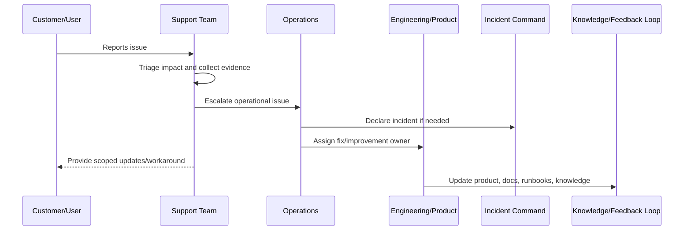

# Support Tooling and Access Boundaries

> *"Defines safe support tooling, access boundaries, customer data handling, impersonation restrictions, audit logging, and least-privilege operations."*

---

# Purpose

Defines safe support tooling, access boundaries, customer data handling, impersonation restrictions, audit logging, and least-privilege operations.

---

# Support Problem

Support tools can become powerful attack surfaces if access, auditability, and data minimization are not designed carefully.

---

# Support Decision

## Decision

CLARA support tools should help support teams investigate customer issues safely without overexposing sensitive data or bypassing authorization.

## Status

Accepted.

---

# Production Support Rule

Every production support issue should be handled as:

```text
Intake -> Triage -> Evidence -> Owner -> Escalation/Resolution -> Customer Update -> Closure -> Feedback Loop
```

A support workflow is incomplete if the team cannot answer:

```text
who is affected
what workflow is blocked
what evidence supports the issue
who owns resolution
whether this is an incident
what can be safely communicated
what workaround exists
what product/engineering improvement is needed
```

---

# Recommended Support Flow



---

# Production-Ready Checklist

- [ ] Intake channel is defined.
- [ ] Triage criteria are defined.
- [ ] Severity/priority model is defined.
- [ ] Evidence requirements are defined.
- [ ] Escalation path exists.
- [ ] Customer communication boundary is clear.
- [ ] Support tooling access is least-privilege.
- [ ] Sensitive support actions are audited.
- [ ] Known issue/workaround process exists.
- [ ] Feedback loop to product/engineering exists.

---

# Acceptance Criteria

- [ ] Support process is clear.
- [ ] Customer impact triage is clear.
- [ ] Escalation ownership is clear.
- [ ] Security/privacy boundaries are clear.
- [ ] Customer communication expectations are clear.
- [ ] Reporting and feedback loop are clear.
- [ ] AI coding assistants can follow this safely.

---

# Anti-patterns

Avoid:

- Support investigating production issues with no evidence standard.
- Sharing unverified incident assumptions with customers.
- Giving broad production database access to support.
- Support impersonation without audit and approval.
- Workarounds that bypass authorization or privacy controls.
- Escalations that say only “it is broken” with no context.
- Closing support tickets without linking known issues or follow-up work.
- Hiding recurring support pain from product and engineering.
- Treating AI/integration complaints as random user confusion.
- Launching features before support is trained.

---

# Related Documents

- ../PART-04-Alerting-and-Incident-Operations/README.md
- ../PART-07-Backup-Restore-and-Disaster-Recovery/README.md
- ../PART-01-Operations-Foundation/README.md
- ../../BOOK-06-Security-Governance-and-Compliance/PART-08-Incident-Response-and-Business-Continuity-Governance/README.md
- ../../BOOK-05-Engineering-Execution-Plan/PART-12-Production-Readiness-and-Handover/README.md

---

# Navigation

**Previous:** `88-Support-Escalation-Workflow.md`

**Next:** `90-Incident-to-Support-Coordination.md`

---

# Support Tooling Requirements

Support tooling should provide:

```text
customer/account lookup
workspace/user membership visibility
ticket/conversation status
integration health state
AI request metadata references
audit log lookup where authorized
feature flag state
known issue references
safe diagnostic summaries
```

---

# Access Boundaries

Support should not have default unrestricted access to:

```text
raw database
secrets
full internal notes without need
raw AI prompts/outputs by default
private attachments
cross-tenant data
security incident details
```

---

# Sensitive Action Rules

Sensitive support actions require:

```text
authorization
reason
audit log
least privilege
time-bound access where practical
approval for high-risk actions
```

---

# Security Rule

Support tooling is part of the production attack surface.
