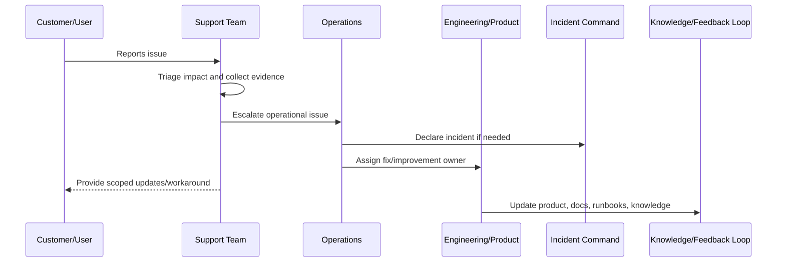

# Customer Communication Operations

> *"Defines customer communication rules for support updates, incident updates, degraded service notices, resolution notices, and post-incident follow-up."*

---

# Purpose

Defines customer communication rules for support updates, incident updates, degraded service notices, resolution notices, and post-incident follow-up.

---

# Support Problem

Poor communication can turn a technical issue into a trust issue.

---

# Support Decision

## Decision

CLARA customer communications should be accurate, timely, scoped, non-speculative, and aligned with incident/security/privacy guidance.

## Status

Accepted.

---

# Production Support Rule

Every production support issue should be handled as:

```text
Intake -> Triage -> Evidence -> Owner -> Escalation/Resolution -> Customer Update -> Closure -> Feedback Loop
```

A support workflow is incomplete if the team cannot answer:

```text
who is affected
what workflow is blocked
what evidence supports the issue
who owns resolution
whether this is an incident
what can be safely communicated
what workaround exists
what product/engineering improvement is needed
```

---

# Recommended Support Flow



---

# Production-Ready Checklist

- [ ] Intake channel is defined.
- [ ] Triage criteria are defined.
- [ ] Severity/priority model is defined.
- [ ] Evidence requirements are defined.
- [ ] Escalation path exists.
- [ ] Customer communication boundary is clear.
- [ ] Support tooling access is least-privilege.
- [ ] Sensitive support actions are audited.
- [ ] Known issue/workaround process exists.
- [ ] Feedback loop to product/engineering exists.

---

# Acceptance Criteria

- [ ] Support process is clear.
- [ ] Customer impact triage is clear.
- [ ] Escalation ownership is clear.
- [ ] Security/privacy boundaries are clear.
- [ ] Customer communication expectations are clear.
- [ ] Reporting and feedback loop are clear.
- [ ] AI coding assistants can follow this safely.

---

# Anti-patterns

Avoid:

- Support investigating production issues with no evidence standard.
- Sharing unverified incident assumptions with customers.
- Giving broad production database access to support.
- Support impersonation without audit and approval.
- Workarounds that bypass authorization or privacy controls.
- Escalations that say only “it is broken” with no context.
- Closing support tickets without linking known issues or follow-up work.
- Hiding recurring support pain from product and engineering.
- Treating AI/integration complaints as random user confusion.
- Launching features before support is trained.

---

# Related Documents

- ../PART-04-Alerting-and-Incident-Operations/README.md
- ../PART-07-Backup-Restore-and-Disaster-Recovery/README.md
- ../PART-01-Operations-Foundation/README.md
- ../../BOOK-06-Security-Governance-and-Compliance/PART-08-Incident-Response-and-Business-Continuity-Governance/README.md
- ../../BOOK-05-Engineering-Execution-Plan/PART-12-Production-Readiness-and-Handover/README.md

---

# Navigation

**Previous:** `91-Known-Issues-and-Workaround-Management.md`

**Next:** `93-Support-Evidence-and-Reporting.md`

---

# Customer Communication Principles

Customer communication should be:

```text
accurate
timely
scoped
non-speculative
empathetic
actionable
consistent
security/privacy-aware
```

---

# Update Template

```markdown
Hi <name>,

We are currently investigating an issue affecting <workflow/scope>.

Current impact:
<known impact>

Current workaround:
<workaround if approved>

Next update:
<time or condition>

We will follow up once we have confirmed resolution.
```

---

# Communication Boundaries

Do not share:

```text
unconfirmed root cause
internal blame
raw logs
security details
other customer data
unapproved timelines
sensitive architecture details
```
