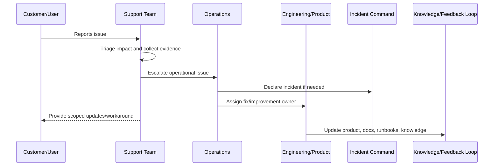

# Part 08 Summary

> *"Summarizes Production Support Operations and prepares for Book VII Part 09."*

---

# Purpose

Summarizes Production Support Operations and prepares for Book VII Part 09.

---

# Support Problem

Runbooks and playbooks come next because support and operations need repeatable procedures for normal and exceptional production scenarios.

---

# Support Decision

## Decision

CLARA should proceed to Runbooks and Playbooks after defining support operating model, triage, escalation, tooling, incident coordination, known issues, customer communication, evidence, feedback loops, and support readiness.

## Status

Accepted.

---

# Production Support Rule

Every production support issue should be handled as:

```text
Intake -> Triage -> Evidence -> Owner -> Escalation/Resolution -> Customer Update -> Closure -> Feedback Loop
```

A support workflow is incomplete if the team cannot answer:

```text
who is affected
what workflow is blocked
what evidence supports the issue
who owns resolution
whether this is an incident
what can be safely communicated
what workaround exists
what product/engineering improvement is needed
```

---

# Recommended Support Flow



---

# Production-Ready Checklist

- [ ] Intake channel is defined.
- [ ] Triage criteria are defined.
- [ ] Severity/priority model is defined.
- [ ] Evidence requirements are defined.
- [ ] Escalation path exists.
- [ ] Customer communication boundary is clear.
- [ ] Support tooling access is least-privilege.
- [ ] Sensitive support actions are audited.
- [ ] Known issue/workaround process exists.
- [ ] Feedback loop to product/engineering exists.

---

# Acceptance Criteria

- [ ] Support process is clear.
- [ ] Customer impact triage is clear.
- [ ] Escalation ownership is clear.
- [ ] Security/privacy boundaries are clear.
- [ ] Customer communication expectations are clear.
- [ ] Reporting and feedback loop are clear.
- [ ] AI coding assistants can follow this safely.

---

# Anti-patterns

Avoid:

- Support investigating production issues with no evidence standard.
- Sharing unverified incident assumptions with customers.
- Giving broad production database access to support.
- Support impersonation without audit and approval.
- Workarounds that bypass authorization or privacy controls.
- Escalations that say only “it is broken” with no context.
- Closing support tickets without linking known issues or follow-up work.
- Hiding recurring support pain from product and engineering.
- Treating AI/integration complaints as random user confusion.
- Launching features before support is trained.

---

# Related Documents

- ../PART-04-Alerting-and-Incident-Operations/README.md
- ../PART-07-Backup-Restore-and-Disaster-Recovery/README.md
- ../PART-01-Operations-Foundation/README.md
- ../../BOOK-06-Security-Governance-and-Compliance/PART-08-Incident-Response-and-Business-Continuity-Governance/README.md
- ../../BOOK-05-Engineering-Execution-Plan/PART-12-Production-Readiness-and-Handover/README.md

---

# Navigation

**Previous:** `95-Support-Readiness-Checklist.md`

**Next:** `../PART-09-Runbooks-and-Playbooks/README.md`

---

# Part 08 Completion

Part 08 establishes:

- Production Support Operations overview.
- Support operating model.
- Customer impact triage.
- Support escalation workflow.
- Support tooling and access boundaries.
- Incident-to-support coordination.
- Known issues and workaround management.
- Customer communication operations.
- Support evidence and reporting.
- Support feedback loop to product and engineering.
- Support readiness checklist.

---

# Ready for Part 09

The next part should be:

```text
BOOK VII — PART 09: Runbooks and Playbooks
```

It should define:

- Runbook architecture.
- Runbook template.
- Incident playbook template.
- Service runbooks.
- AI runbooks.
- Integration runbooks.
- Database/queue runbooks.
- Support playbooks.
- Recovery playbooks.
- Runbook review cadence.
- Runbook quality checklist.
