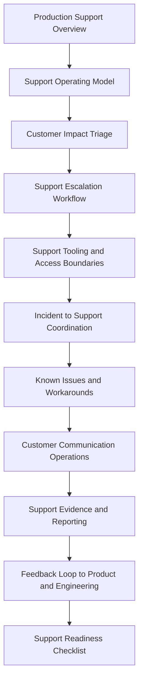

# PART-08 — Production Support Operations

> *"Support is not separate from operations. Support is how production pain becomes visible."*

---

# Purpose

Part 08 defines CLARA's production support operations model.

It covers:

- Production Support Operations overview.
- Support Operating Model.
- Customer Impact Triage.
- Support Escalation Workflow.
- Support Tooling and Access Boundaries.
- Incident to Support Coordination.
- Known Issues and Workaround Management.
- Customer Communication Operations.
- Support Evidence and Reporting.
- Support Feedback Loop to Product and Engineering.
- Support Readiness Checklist.

---

# Chapter Map

| Chapter | Title |
|---:|---|
| 85 | Production Support Operations Overview |
| 86 | Support Operating Model |
| 87 | Customer Impact Triage |
| 88 | Support Escalation Workflow |
| 89 | Support Tooling and Access Boundaries |
| 90 | Incident to Support Coordination |
| 91 | Known Issues and Workaround Management |
| 92 | Customer Communication Operations |
| 93 | Support Evidence and Reporting |
| 94 | Support Feedback Loop to Product and Engineering |
| 95 | Support Readiness Checklist |
| 96 | Part 08 Summary |

---

# Production Support Map



---

# Support Operations Non-Negotiables

CLARA production support must enforce:

```text
clear support intake
customer impact triage
severity and escalation rules
safe support tooling
least-privilege support access
audit logging for sensitive support actions
incident-support coordination
approved customer communication boundaries
known issue tracking
workaround ownership and review
support evidence capture
feedback loop to engineering/product
support readiness before launch
```

---

# Relationship to Previous Parts

Part 07 defines backup, restore, and disaster recovery.

Part 08 defines how production issues are handled from the customer/support side and connected back to operations, engineering, and product improvement.

---

# Navigation

**Previous:** `../PART-07-Backup-Restore-and-Disaster-Recovery/84-Part-07-Summary.md`

**Next:** `85-Production-Support-Operations-Overview.md`
