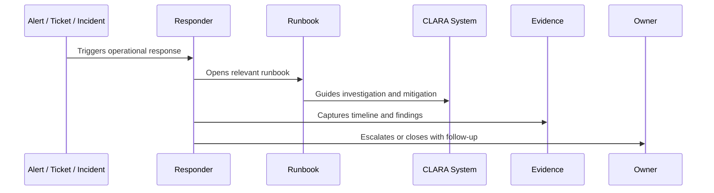

# Service Runbooks

> *"Defines standards for service-specific runbooks such as API, auth, inbox, ticketing, notification, file storage, search, and audit logging."*

---

# Purpose

Defines standards for service-specific runbooks such as API, auth, inbox, ticketing, notification, file storage, search, and audit logging.

---

# Operational Problem

A service without a runbook depends too much on the original implementer.

---

# Operational Decision

## Decision

Every critical CLARA service should have a runbook that explains health signals, dashboards, known failure modes, mitigation, recovery, and escalation.

## Status

Accepted.

---

# Runbook Rule

Every critical CLARA operational procedure must be documented as:

```text
Trigger -> Owner -> Symptoms -> Investigation -> Mitigation -> Escalation -> Evidence -> Follow-Up -> Review
```

A runbook is incomplete if the responder cannot answer:

```text
when to use it
what to check first
what is safe to do
what is dangerous to do
who to escalate to
what evidence to collect
how to confirm recovery
what to update after recovery
```

---

# Recommended Runbook Flow



---

# Production-Ready Checklist

- [ ] Trigger is clear.
- [ ] Owner is clear.
- [ ] Required permissions are clear.
- [ ] Dashboards/logs/metrics are linked.
- [ ] Diagnosis steps are actionable.
- [ ] Mitigation steps are safe.
- [ ] Escalation path is defined.
- [ ] Evidence capture is defined.
- [ ] Customer/support communication note exists where needed.
- [ ] Last reviewed date is documented.

---

# Acceptance Criteria

- [ ] Procedure is repeatable.
- [ ] Safety boundaries are clear.
- [ ] Security/privacy warnings are explicit.
- [ ] Evidence expectations are clear.
- [ ] Escalation path is clear.
- [ ] Review cadence exists.
- [ ] AI coding assistants can follow this safely.

---

# Anti-patterns

Avoid:

- Runbooks that only say “ask senior engineer.”
- Missing owner.
- Missing last reviewed date.
- Commands with no explanation or safety warning.
- Destructive recovery steps without approval.
- Customer data exposure in screenshots/log examples.
- No rollback or stop condition.
- No validation step after mitigation.
- Incident playbooks without communication rules.
- Runbooks that are not updated after incidents.

---

# Related Documents

- ../PART-08-Production-Support-Operations/README.md
- ../PART-07-Backup-Restore-and-Disaster-Recovery/README.md
- ../PART-04-Alerting-and-Incident-Operations/README.md
- ../PART-03-Logging-and-Metrics/README.md
- ../../BOOK-06-Security-Governance-and-Compliance/PART-08-Incident-Response-and-Business-Continuity-Governance/README.md

---

# Navigation

**Previous:** `100-Incident-Playbook-Template-Standard.md`

**Next:** `102-AI-Operations-Runbooks.md`

---

# Required Service Runbooks

Initial CLARA service runbooks should include:

```text
authentication/session runbook
inbox/conversation runbook
reply sending runbook
ticket workflow runbook
knowledge search runbook
file/attachment runbook
notification/email runbook
audit logging runbook
export runbook
admin/settings runbook
```

---

# Service Runbook Sections

A service runbook should define:

```text
service purpose
critical workflows
dependencies
health metrics
dashboards
alerts
known failure modes
diagnosis steps
mitigation steps
rollback/disable path
owner/escalation
```

---

# Service Rule

A critical service is production-owned only when its runbook exists and is reviewed.
