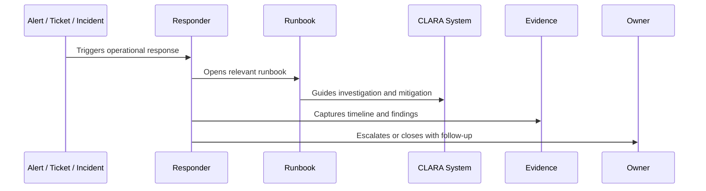

# AI Operations Runbooks

> *"Defines runbook standards for AI Gateway, provider failures, prompt rollback, RAG/context issues, safety blocks, latency spikes, cost spikes, and AI kill switches."*

---

# Purpose

Defines runbook standards for AI Gateway, provider failures, prompt rollback, RAG/context issues, safety blocks, latency spikes, cost spikes, and AI kill switches.

---

# Operational Problem

AI incidents are harder to operate when prompt versions, providers, context sources, and human review states are not documented.

---

# Operational Decision

## Decision

CLARA AI runbooks should make AI failures diagnosable, containable, reversible, and safe for customer communication.

## Status

Accepted.

---

# Runbook Rule

Every critical CLARA operational procedure must be documented as:

```text
Trigger -> Owner -> Symptoms -> Investigation -> Mitigation -> Escalation -> Evidence -> Follow-Up -> Review
```

A runbook is incomplete if the responder cannot answer:

```text
when to use it
what to check first
what is safe to do
what is dangerous to do
who to escalate to
what evidence to collect
how to confirm recovery
what to update after recovery
```

---

# Recommended Runbook Flow



---

# Production-Ready Checklist

- [ ] Trigger is clear.
- [ ] Owner is clear.
- [ ] Required permissions are clear.
- [ ] Dashboards/logs/metrics are linked.
- [ ] Diagnosis steps are actionable.
- [ ] Mitigation steps are safe.
- [ ] Escalation path is defined.
- [ ] Evidence capture is defined.
- [ ] Customer/support communication note exists where needed.
- [ ] Last reviewed date is documented.

---

# Acceptance Criteria

- [ ] Procedure is repeatable.
- [ ] Safety boundaries are clear.
- [ ] Security/privacy warnings are explicit.
- [ ] Evidence expectations are clear.
- [ ] Escalation path is clear.
- [ ] Review cadence exists.
- [ ] AI coding assistants can follow this safely.

---

# Anti-patterns

Avoid:

- Runbooks that only say “ask senior engineer.”
- Missing owner.
- Missing last reviewed date.
- Commands with no explanation or safety warning.
- Destructive recovery steps without approval.
- Customer data exposure in screenshots/log examples.
- No rollback or stop condition.
- No validation step after mitigation.
- Incident playbooks without communication rules.
- Runbooks that are not updated after incidents.

---

# Related Documents

- ../PART-08-Production-Support-Operations/README.md
- ../PART-07-Backup-Restore-and-Disaster-Recovery/README.md
- ../PART-04-Alerting-and-Incident-Operations/README.md
- ../PART-03-Logging-and-Metrics/README.md
- ../../BOOK-06-Security-Governance-and-Compliance/PART-08-Incident-Response-and-Business-Continuity-Governance/README.md

---

# Navigation

**Previous:** `101-Service-Runbooks.md`

**Next:** `103-Integration-and-Webhook-Runbooks.md`

---

# AI Runbook Scenarios

Create runbooks for:

```text
AI provider outage
AI latency spike
AI cost spike
AI safety block spike
prompt regression
RAG/context retrieval failure
AI output quality regression
AI Gateway degraded mode
AI kill switch activation
human review backlog
```

---

# AI Runbook Evidence

Capture:

```text
ai_request_id
feature
provider/model
prompt_template_id/version
context source count
latency
safety block metadata
review status
fallback/kill switch status
cost estimate
```

---

# AI Safety Rule

Do not ask responders to inspect raw prompts or outputs unless access is justified and approved.
