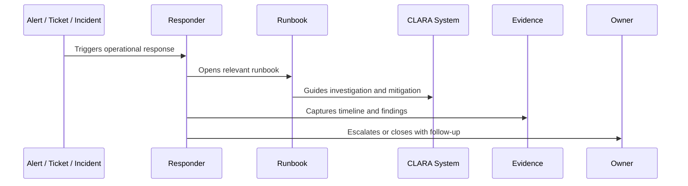

# Support Playbooks

> *"Defines playbooks for support triage, customer impact assessment, escalation packaging, known issues, workaround communication, and incident coordination."*

---

# Purpose

Defines playbooks for support triage, customer impact assessment, escalation packaging, known issues, workaround communication, and incident coordination.

---

# Operational Problem

Support teams need repeatable guidance to avoid inconsistent customer communication and unsafe workarounds.

---

# Operational Decision

## Decision

CLARA support playbooks should make support operations consistent, safe, evidence-backed, and aligned with engineering response.

## Status

Accepted.

---

# Runbook Rule

Every critical CLARA operational procedure must be documented as:

```text
Trigger -> Owner -> Symptoms -> Investigation -> Mitigation -> Escalation -> Evidence -> Follow-Up -> Review
```

A runbook is incomplete if the responder cannot answer:

```text
when to use it
what to check first
what is safe to do
what is dangerous to do
who to escalate to
what evidence to collect
how to confirm recovery
what to update after recovery
```

---

# Recommended Runbook Flow



---

# Production-Ready Checklist

- [ ] Trigger is clear.
- [ ] Owner is clear.
- [ ] Required permissions are clear.
- [ ] Dashboards/logs/metrics are linked.
- [ ] Diagnosis steps are actionable.
- [ ] Mitigation steps are safe.
- [ ] Escalation path is defined.
- [ ] Evidence capture is defined.
- [ ] Customer/support communication note exists where needed.
- [ ] Last reviewed date is documented.

---

# Acceptance Criteria

- [ ] Procedure is repeatable.
- [ ] Safety boundaries are clear.
- [ ] Security/privacy warnings are explicit.
- [ ] Evidence expectations are clear.
- [ ] Escalation path is clear.
- [ ] Review cadence exists.
- [ ] AI coding assistants can follow this safely.

---

# Anti-patterns

Avoid:

- Runbooks that only say “ask senior engineer.”
- Missing owner.
- Missing last reviewed date.
- Commands with no explanation or safety warning.
- Destructive recovery steps without approval.
- Customer data exposure in screenshots/log examples.
- No rollback or stop condition.
- No validation step after mitigation.
- Incident playbooks without communication rules.
- Runbooks that are not updated after incidents.

---

# Related Documents

- ../PART-08-Production-Support-Operations/README.md
- ../PART-07-Backup-Restore-and-Disaster-Recovery/README.md
- ../PART-04-Alerting-and-Incident-Operations/README.md
- ../PART-03-Logging-and-Metrics/README.md
- ../../BOOK-06-Security-Governance-and-Compliance/PART-08-Incident-Response-and-Business-Continuity-Governance/README.md

---

# Navigation

**Previous:** `104-Database-Queue-and-Worker-Runbooks.md`

**Next:** `106-Recovery-and-DR-Playbooks.md`

---

# Support Playbook Scenarios

Create support playbooks for:

```text
login/access issue
message not received
reply failed
AI draft poor quality
integration disconnected
attachment cannot upload/download
export delayed/failed
known issue communication
incident customer update
security/privacy escalation
```

---

# Support Playbook Fields

```text
symptoms
triage questions
customer impact assessment
evidence to collect
safe troubleshooting steps
escalation package
approved workaround
customer communication template
closure criteria
```

---

# Support Rule

Support playbooks should reduce escalation noise while preserving fast escalation for high-impact or risky issues.
