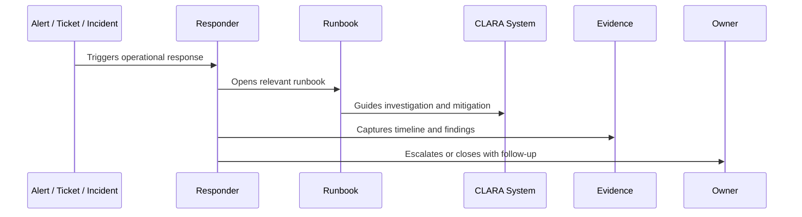

# Recovery and DR Playbooks

> *"Defines playbooks for backup restore, database recovery, file restore, bad deployment recovery, provider outage fallback, configuration bootstrap, and disaster recovery coordination."*

---

# Purpose

Defines playbooks for backup restore, database recovery, file restore, bad deployment recovery, provider outage fallback, configuration bootstrap, and disaster recovery coordination.

---

# Operational Problem

Recovery work is high-risk because mistakes can cause data loss, data exposure, or prolonged outage.

---

# Operational Decision

## Decision

CLARA recovery playbooks should connect technical restore procedures with ownership, approval, validation, evidence, and communication.

## Status

Accepted.

---

# Runbook Rule

Every critical CLARA operational procedure must be documented as:

```text
Trigger -> Owner -> Symptoms -> Investigation -> Mitigation -> Escalation -> Evidence -> Follow-Up -> Review
```

A runbook is incomplete if the responder cannot answer:

```text
when to use it
what to check first
what is safe to do
what is dangerous to do
who to escalate to
what evidence to collect
how to confirm recovery
what to update after recovery
```

---

# Recommended Runbook Flow



---

# Production-Ready Checklist

- [ ] Trigger is clear.
- [ ] Owner is clear.
- [ ] Required permissions are clear.
- [ ] Dashboards/logs/metrics are linked.
- [ ] Diagnosis steps are actionable.
- [ ] Mitigation steps are safe.
- [ ] Escalation path is defined.
- [ ] Evidence capture is defined.
- [ ] Customer/support communication note exists where needed.
- [ ] Last reviewed date is documented.

---

# Acceptance Criteria

- [ ] Procedure is repeatable.
- [ ] Safety boundaries are clear.
- [ ] Security/privacy warnings are explicit.
- [ ] Evidence expectations are clear.
- [ ] Escalation path is clear.
- [ ] Review cadence exists.
- [ ] AI coding assistants can follow this safely.

---

# Anti-patterns

Avoid:

- Runbooks that only say “ask senior engineer.”
- Missing owner.
- Missing last reviewed date.
- Commands with no explanation or safety warning.
- Destructive recovery steps without approval.
- Customer data exposure in screenshots/log examples.
- No rollback or stop condition.
- No validation step after mitigation.
- Incident playbooks without communication rules.
- Runbooks that are not updated after incidents.

---

# Related Documents

- ../PART-08-Production-Support-Operations/README.md
- ../PART-07-Backup-Restore-and-Disaster-Recovery/README.md
- ../PART-04-Alerting-and-Incident-Operations/README.md
- ../PART-03-Logging-and-Metrics/README.md
- ../../BOOK-06-Security-Governance-and-Compliance/PART-08-Incident-Response-and-Business-Continuity-Governance/README.md

---

# Navigation

**Previous:** `105-Support-Playbooks.md`

**Next:** `107-Runbook-Review-Cadence-and-Quality-Checklist.md`

---

# Recovery Playbooks

Create playbooks for:

```text
database restore
point-in-time restore
file/object restore
bad migration recovery
bad deployment rollback
configuration bootstrap
secret rotation after compromise
provider outage fallback
region/provider disaster
observability outage workaround
```

---

# Recovery Approval

High-risk recovery actions require:

```text
recovery owner
impact assessment
approved recovery point
communication owner
validation checklist
evidence capture
rollback/failback plan
```

---

# Recovery Rule

Never improvise destructive recovery steps in production without a documented decision and owner.
